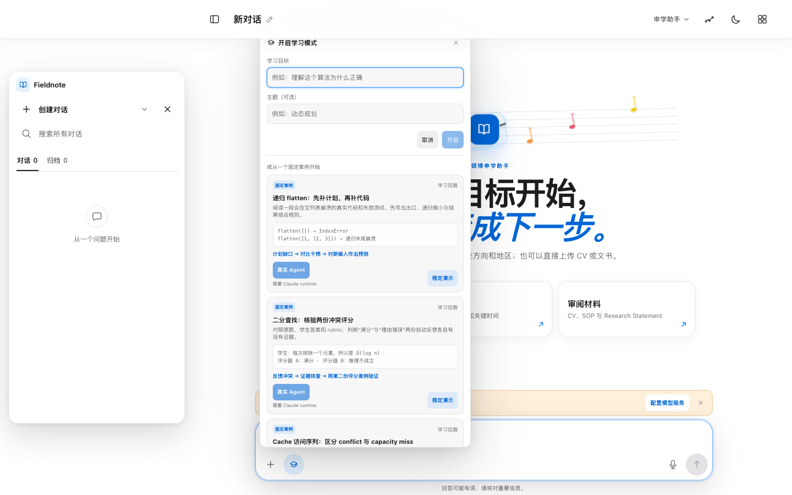
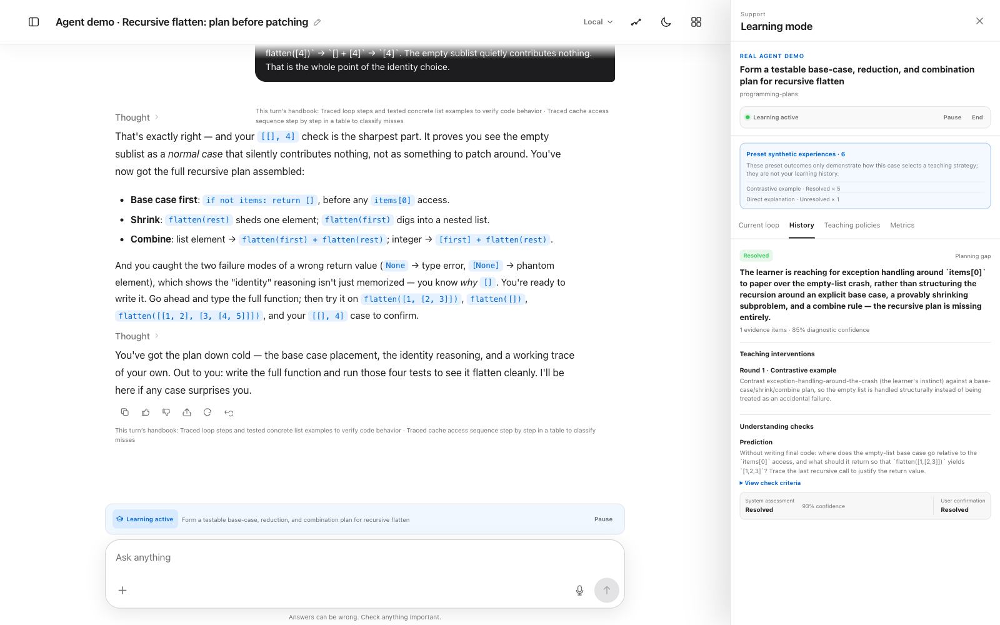
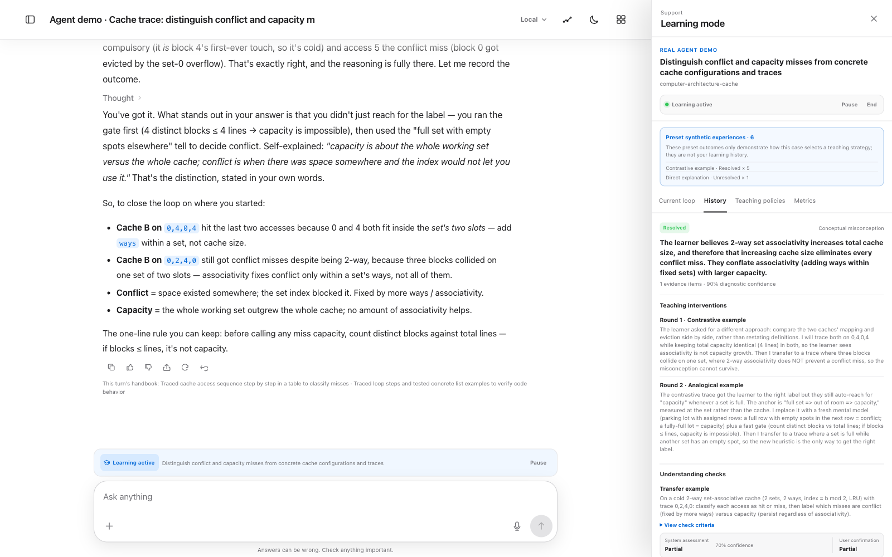
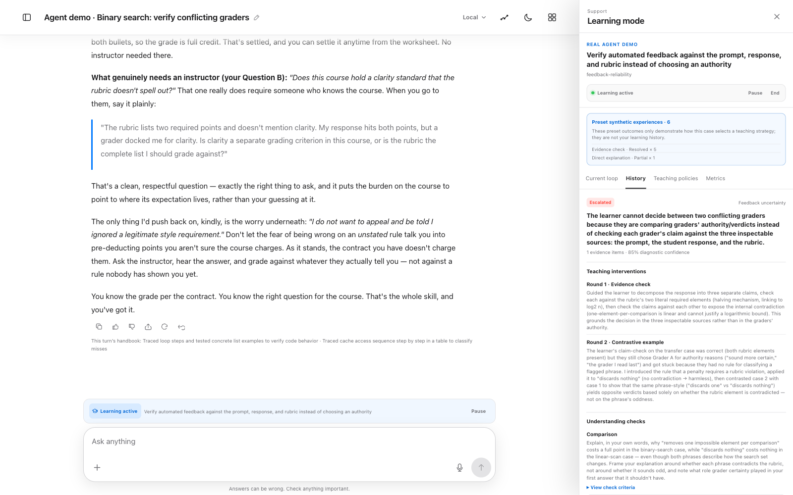

# Fieldnote

A local-first Claude Agent workbench for education: an assistant that diagnoses the misconception behind your mistake, teaches it with an explicit strategy, and checks with a task written for that diagnosis — where you, not the model, deliver the verdict.

[](https://github.com/YukunHe16/fieldnote/actions/workflows/ci.yml)
[](LICENSE)
[](.nvmrc)
[](https://www.npmjs.com/package/fieldnote)

**English** · [简体中文](README.zh-CN.md)


## Features

**Adaptive learning mode** — An educational on-call loop: set a goal → locate the specific difficulty → diagnose the cause → choose an explanation or exercise → collect verification evidence → you confirm the outcome. It covers 6 difficulty types, 8 teaching strategies, and 5 verification methods, with at most three intervention rounds per incident. The system may only *propose* an outcome; "understood / partly understood / still stuck" is always your call. The learner-facing conversation contains only teaching and practice — diagnosis, confidence, and strategy live in a separate learning panel. That panel now ships a metrics tab (resolution rates, intervention rounds, system-verdict calibration); research mode adds comparison conditions (adaptive loop vs a turns-matched continued-conversation baseline, or a one-shot baseline), an anonymized data export ([field reference](docs/RESEARCH_EXPORT.md)), and a rerunnable offline evaluation set ([design & sources](docs/internal/LEARNING_EVAL.md)). The loop also keeps watch on its own: resolved difficulties get +2d/+7d spaced-review revisits with fresh transfer tasks, exhausted incidents produce a structured handoff report (optionally paged to Feishu), and winning teaching moves are distilled into candidate approaches that trial and promote only through human review with host-attributed evidence. Outcome confirmation and a `/learn` command work over Feishu too.



**Human-governed self-evolution and cross-chat memory** — Teaching strategies evolve from outcomes you confirmed, using a Beta posterior; a pending revision is only proposed once evidence thresholds are met, is previewed deterministically against frozen historical snapshots, and is enabled, rejected, or rolled back by you. General capability evolution proposes new Skill or subagent candidates under the same human review and cannot bypass hard safety checks. Cross-chat memory is organised into profile, preferences, goals, and projects, managed by this project's own SQLite memory layer; it is refined periodically and never rewrites entries you pinned by hand.

**Feishu (Lark) channel** — The same capabilities are reachable from a Feishu bot over a local long-lived connection — no public IP or tunnelling required. CardKit cards stream Thinking, the active Skill, and specialist activity, and support `/new`, `/agent`, `/stop`, `/continue`, and `/guide`.

Secondary capabilities: **Run Replay** (replay a run against a frozen local input boundary, for auditing and before/after comparison when enabling a capability), **workspace sandboxing** (each conversation gets its own directory, agent writes are confined to it, and input attachments are read-only), **document skills** (export Markdown sources to real DOCX/PDF, with optional on-demand Office skills), and **temporary chats** (no cross-chat memory read or written; cleaned up when they end).

## Research

Learning mode treats tutoring as an **educational on-call loop** rather than a one-shot answer: a difficulty becomes an *incident* with a diagnosis, each teaching move is a recorded *intervention* with a strategy and an expected signal, understanding is checked by *verification* whose system verdict is stored separately from the learner's own confirmation, and an incident that survives three rounds *escalates* to a human with a structured handoff report. Treatment, outcome, and failure are all first-class records, which is what makes the loop studyable.

**Diagnosis before treatment.** The loop names the missing layer — here, a recursion plan gap behind an exception-handling instinct — and keeps its confidence and evidence out of the learner-facing conversation. The panel on the right also shows the system's verdict and the learner's confirmation as separate records:



**Strategy switching on the record.** When round one ends `partial`, the loop switches strategy (here contrastive → analogical) and re-verifies with a transfer task, not a repeat question — every round carries its rationale:



**Abstention as a feature.** When the remaining blocker is a question only a human instructor can answer, the loop escalates instead of manufacturing an answer, and writes a handoff report: what was tried round by round, what the learner still cannot do, and what a human should try next:



The candidate research questions this instrumentation exists for: *Can bounded, plan-aware scaffolding improve plan acquisition and transfer compared with one-shot planning feedback? Can uncertainty-aware verification reduce students' acceptance of incorrect AI feedback without excessive escalation? Can a conversation-first remediation loop reduce interventions-to-mastery for a well-defined misconception?*

**Evidence status, stated honestly.** The screens above are real agent sessions over synthetic demo scenarios; nothing here is evidence about real students. In offline evaluation against scripted-misconception items, the loop's first diagnosis matched the scripted misconception in **166/176 sessions (94%)**; outcome comparisons (adaptive loop vs baselines) are retired until they can be run with real learners, because LLM-simulated students cannot fail believably — the full instrument post-mortem, with the evidence and the follow-up study designs, is in [docs/internal/EVAL_LESSONS.md](docs/internal/EVAL_LESSONS.md). Method and item sources: [docs/internal/LEARNING_EVAL.md](docs/internal/LEARNING_EVAL.md) · anonymized export: [docs/RESEARCH_EXPORT.md](docs/RESEARCH_EXPORT.md).

## Quick start

```bash
npx fieldnote
```

The first run walks you through a setup wizard, then starts a local server on `127.0.0.1:8787` and opens your browser. Data, configuration, and conversation workspaces are written to `~/.fieldnote` by default; override with `FIELDNOTE_HOME`.

If the Claude CLI already works on this machine, no extra configuration is needed: Fieldnote reuses the authentication, model mapping, plugins, skills, permissions, and MCP servers already active in `~/.claude/settings.json` and `~/.claude.json` — no token copying. Without a Claude CLI setup, open **Workspace → Model service** and fill in `ANTHROPIC_AUTH_TOKEN`, an optional `ANTHROPIC_BASE_URL`, and a model name; it applies from your next message. To explore the interface first, run `npx fieldnote --demo` (or set `AGENT_RUNTIME=demo`): the demo shows real sessions and streaming states without calling an external model.

Other subcommands: `npx fieldnote doctor` checks this machine's environment, `npx fieldnote data` prints the current data directory, and `npx fieldnote reset` backs up and clears the data directory.

### Run from source

```bash
git clone https://github.com/YukunHe16/fieldnote.git
cd fieldnote
pnpm setup   # same as pnpm workbench:setup
pnpm dev
```

Open [http://127.0.0.1:5173](http://127.0.0.1:5173) (the API runs on `127.0.0.1:8787`, health check at `/api/health`).

Developing from source requires Node ≥ 22.13 (a pnpm 11 requirement; running `npx fieldnote` only needs Node ≥ 20). `pnpm setup` checks Node.js and pnpm, runs `pnpm install` when dependencies are missing, creates `.env` and `data/workspaces` (never overwriting an existing `.env`), and detects local Claude authentication, a compatible base URL, plugins, and MCP servers — reporting only whether configuration is usable, never printing secret values. In source mode, data lives in the repository's `data/` directory.

## Common commands

| Command | Purpose |
| --- | --- |
| `pnpm setup` | First-time initialisation; preserves existing configuration |
| `pnpm doctor` | Safely check authentication, MCP, plugins, ports, directories, and external tools |
| `pnpm skills:office` | Install Anthropic's official pdf/docx/xlsx skills on demand (not distributed with this repository) |
| `pnpm dev` | Start the web and API development servers |
| `pnpm typecheck` | Check all TypeScript types |
| `pnpm test` | Run server and web tests |
| `pnpm build` | Produce a production build |
| `NODE_ENV=production pnpm start` | Run the built local production server |

## Tech stack and repository layout

TypeScript · React 19 + Vite · Fastify · SQLite (better-sqlite3) · [Claude Agent SDK](https://docs.claude.com/en/api/agent-sdk/overview) · MCP · Feishu CardKit · Vitest · Biome.

```text
apps/web                 React + Vite chat workbench (SSE streaming, learning panel)
apps/server              Fastify API, SQLite, agent runtime, specialist collaboration, Feishu channel
apps/server/plugins      Governed Skills plugins shipped with the repo (documents, humanizer-zh)
packages/contracts       Types shared across web, server, and channels
packages/fieldnote       The `fieldnote` CLI published to npm (the npx entry point)
scripts/workbench.mjs    Local setup, doctor, and on-demand skill installation
data/                    Local data: SQLite, conversation workspaces, evolution artifacts (never committed)
```

The quality gate is `pnpm lint && pnpm typecheck && pnpm test && pnpm build` — roughly 365 tests, all hermetic: no network access and no model quota consumed.

## Configuration reference

Most users only need to run setup; the table below rarely needs manual edits. **To use a third-party Anthropic-compatible service (DeepSeek, Kimi, GLM, ...), pick the provider preset in Workspace → Model service** — the endpoint and the alias mapping below are filled in for you, and you only paste your key.

| Environment variable | Default | Purpose |
| --- | --- | --- |
| `FIELDNOTE_HOME` | `~/.fieldnote` (the repository root when running from source) | Data root override; `DATABASE_PATH` and `AGENT_WORKSPACE_ROOT` resolve against it |
| `HOST` / `PORT` | `127.0.0.1` / `8787` | Local API address |
| `DATABASE_PATH` | `./data/agent.db` | SQLite database |
| `AGENT_WORKSPACE_ROOT` | `./data/workspaces` | Conversation workspace root |
| `AGENT_RUNTIME` | `auto` | `auto`, `claude`, or `demo` |
| `ANTHROPIC_AUTH_TOKEN` | empty | Access token for Claude or a compatible service |
| `ANTHROPIC_BASE_URL` | Anthropic default | Optional compatible API address |
| `ANTHROPIC_MODEL` | empty | Default model name for a compatible service |
| `ANTHROPIC_DEFAULT_SONNET_MODEL_NAME` and friends | empty | Alias mapping for a compatible service. Fieldnote's background work (titles, memory upkeep) asks for the `sonnet` alias, so without the mapping chat works while background work fails |
| `CLAUDE_CODE_SUBAGENT_MODEL` | empty | Model used by subagents |
| `CLAUDE_SETTINGS_MODE` | `auto` | `auto`, `inherit-user`, or `isolated` |
| `CLAUDE_CONFIG_DIR` | `~/.claude` | Optional Claude configuration directory |
| `AGENT_MODEL` | `sonnet` | Model alias or full ID; may be resolved by local mapping |
| `AGENT_MAX_CONCURRENCY` | `2` | Number of agents running concurrently |
| `AGENT_MAX_TURNS` | `30` | Maximum agent turns per run |
| `AGENT_RUN_TIMEOUT_MINUTES` | `20` | Application-level timeout |
| `AGENT_MAX_BUDGET_USD` | `2` | Per-run budget cap for the main agent; managed specialists (delegated subagents) have no dollar cap |
| `FEISHU_APP_ID` / `FEISHU_APP_SECRET` | empty | Setting both enables Feishu |
| `FEISHU_ALLOWED_OPEN_IDS` | empty | open_ids allowed to use the bot |
| `WEB_APP_URL` | `http://127.0.0.1:5173` | Local web address used by the "open conversation" button on Feishu cards |

## Platform support

| Platform | Status | Notes |
| --- | --- | --- |
| macOS | Fully supported | The primary development and daily-use platform |
| Linux | Works, export is conditional | DOCX export uses a built-in minimal writer (requires the `zip` command); PDF export requires LibreOffice (`soffice`); everything else works normally |
| Windows | Untested | Running under WSL is recommended |

Document skills optionally depend on external tools: `uv` / `python3` (PDF and Markdown conversion), `dotnet` (docx-creator), LibreOffice `soffice` (xlsx recalculation and PDF export off macOS), and `tesseract` (OCR). None of them block startup, and `pnpm doctor` reports each one.

## Project status and non-goals

This is a `0.x` **single-user local product**: there is no login or authorisation, and APIs and data structures may still change in breaking ways — check the [changelog](CHANGELOG.md) before upgrading.

Things it deliberately does not do: no PrairieLearn integration and no question bank, examination, grading, or course-management system; learning mode does not claim proven learning effects, does not use reinforcement learning, and never enables a teaching policy on its own; it is not a multi-tenant SaaS; and it will not make payments, send email, or make any irreversible decision for you. The full boundary list is in [the feature guide's explicit non-goals](docs/FEATURES.md#15-明确的非目标与限制--explicit-non-goals-and-limitations).

## Security model

- The server may only bind to a loopback address (enforced by a hard check). The 0.x releases have no login or authorisation, so **do not expose it through the public internet or a reverse proxy**;
- The agent runs with `bypassPermissions` inside an application-level sandbox: writes are confined to the current conversation workspace, and sensitive directories such as SSH, AWS, GnuPG, gcloud, and kube configuration are denied for reading. This is a protective layer, **not a virtual-machine boundary**;
- `data/agent.db` is unencrypted SQLite holding runtime configuration (including local secret values), SDK sessions, and Thinking streams. Configuration APIs never return tokens, but the database itself is not a secret vault — do not share it;
- `CLAUDE_SETTINGS_MODE=inherit-user` deliberately loads your personal Claude plugins, skills, MCP servers, and permissions, and suits a trusted personal machine only; CI and shared machines must use `isolated`;
- The Feishu App Secret is stored in local SQLite and read only by the server. Claude Code Auto Memory is explicitly disabled — memory is managed solely by this project;
- This is a single-user local product, not a multi-tenant isolated SaaS. Rotate any secret that was ever pasted into a chat, an issue, or a log.

The complete threat model and vulnerability reporting process is in [SECURITY.md](SECURITY.md).

## Troubleshooting

The first step is always `pnpm doctor` (or `npx fieldnote doctor`). It reports only whether configuration is usable and never prints a token or base URL.

- **The page will not open**: confirm both `pnpm dev` processes are still running; check whether `5173` / `8787` are already in use; the web app is on `5173` — do not use the API address as the page address.
- **It says demo runtime**: check `Selected runtime` in doctor. With an existing Claude CLI setup, confirm `CLAUDE_SETTINGS_MODE` is not `isolated`, or save credentials in **Workspace → Model service** — the switch takes effect from your next message.
- **It says “organization has disabled Claude subscription access” or “organization does not have access to Claude”**: the account behind the machine's `claude login` has Claude Code disabled by its organization — the credentials exist but cannot be used, and the plain `claude` command fails the same way. Doctor reports this as a failure. Use an Anthropic API key, or pick a compatible provider in **Workspace → Model service**; the credential you configure takes precedence over the machine login.
- **The tutor never runs the learning loop** (no incident is opened and the reply still reads normally): tool search is on, which hides most of the agent's tools behind a search step. Fieldnote pins `ENABLE_TOOL_SEARCH=false` for the agent child, but Claude Code applies `~/.claude/settings.json`'s own `env` block over that in `inherit-user` mode — so remove `ENABLE_TOOL_SEARCH` from that file. Doctor reports this as `Tool surface`.
- **MCP servers or plugins are missing**: confirm doctor discovers the name. Reusing local configuration requires `CLAUDE_SETTINGS_MODE=auto` or `inherit-user`. The project never copies MCP credentials into SQLite or the frontend.
- **Feishu receives nothing**: confirm `Feishu long connection is ready` appears in the log; check that the app version published the latest permissions and events; in group chats the bot must be explicitly @-mentioned. See the [Feishu setup guide](docs/FEISHU_SETUP.md#6-故障排查) (Chinese).

## Documentation

- [Complete Feature Guide](docs/FEATURES.md) — bilingual reference for capabilities, boundaries, and explicit non-goals
- [User guide](docs/USER_GUIDE.md) (Chinese) — full semantics for conversation management, agent control, learning mode, memory, workspaces, and Feishu
- [Local Feishu bot setup](docs/FEISHU_SETUP.md) (Chinese)
- [Feishu, self-evolution, and memory](docs/飞书-自进化-记忆.md) (Chinese)
- [Contributing](CONTRIBUTING.md) · [Security model and vulnerability reporting](SECURITY.md) · [Changelog](CHANGELOG.md) · [Third-party notices](THIRD_PARTY_NOTICES.md)

## License

[MIT](LICENSE). Third-party Skills shipped with this repository, and the Anthropic Office skills installed on demand, remain under their own licenses — see the [third-party notices](THIRD_PARTY_NOTICES.md).

## Visual design

The interface is built on the pure-white and dark semantic themes of iOS/macOS. The staff lines, scattered coloured notes, and walking rhythm in the light theme are inspired by Eason Chan's 2017 album [*C'mon in~*](https://music.apple.com/tw/album/cmon-in/1440909180), but every element is drawn from scratch in CSS/SVG — no cover artwork is included in this repository.
