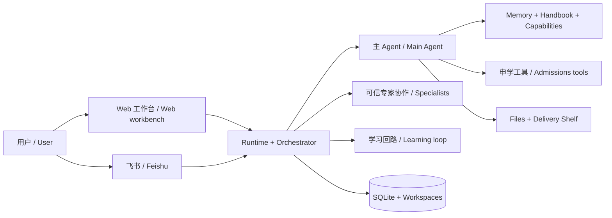

# Fieldnote 项目完整功能总览 / Complete Feature Guide

> 当前实现基线 / Implementation baseline: `ae82c0f` (2026-08-21)
>
> 本文描述当前代码中已经实现的产品能力和边界，不把路线图、旧计划或研究设想写成现有功能。
>
> This document describes capabilities and boundaries implemented in the current codebase. Roadmap items, earlier plans, and research ideas are not presented as shipped features.

## 目录 / Contents

1. [产品定位 / Product identity](#1-产品定位--product-identity)
2. [产品形态与能力矩阵 / Surfaces and capability matrix](#2-产品形态与能力矩阵--surfaces-and-capability-matrix)
3. [Agent 运行时与对话 / Agent runtime and conversations](#3-agent-运行时与对话--agent-runtime-and-conversations)
4. [助手 Profile / Assistant profiles](#4-助手-profile--assistant-profiles)
5. [申学助手 / Graduate-admissions assistant](#5-申学助手--graduate-admissions-assistant)
6. [对话式学习模式 / Adaptive learning conversation mode](#6-对话式学习模式--adaptive-learning-conversation-mode)
7. [可信专家协作 / Trusted specialist collaboration](#7-可信专家协作--trusted-specialist-collaboration)
8. [跨对话记忆 / Cross-conversation memory](#8-跨对话记忆--cross-conversation-memory)
9. [手册与通用自进化 / Handbook and general self-evolution](#9-手册与通用自进化--handbook-and-general-self-evolution)
10. [文件、工作区与成品货架 / Files, workspaces, and delivery shelf](#10-文件工作区与成品货架--files-workspaces-and-delivery-shelf)
11. [回放、重试与分支 / Replay, retry, and branches](#11-回放重试与分支--replay-retry-and-branches)
12. [定时任务 / Scheduled jobs](#12-定时任务--scheduled-jobs)
13. [飞书渠道 / Feishu channel](#13-飞书渠道--feishu-channel)
14. [数据、事件与 API / Data, events, and APIs](#14-数据事件与-api--data-events-and-apis)
15. [配置、部署与可观察性 / Configuration, deployment, and observability](#15-配置部署与可观察性--configuration-deployment-and-observability)
16. [安全与隐私边界 / Security and privacy boundaries](#16-安全与隐私边界--security-and-privacy-boundaries)
17. [明确的非目标与限制 / Explicit non-goals and limitations](#17-明确的非目标与限制--explicit-non-goals-and-limitations)

## 1. 产品定位 / Product identity

### 中文

Fieldnote 是一个运行在本机、可扩展的 Claude Agent 教育助手工作台。它以持续对话为主要交互方式，提供文件处理、研究、长期上下文、受控能力演进和多渠道接入。

当前产品只有一个完整落地的教育业务方向：面向美国、加拿大、香港和新加坡硕士、MPhil 与 PhD 申请的申学助手。`local-operator`（界面中的“本地助手”）是通用文件、研究和多步骤任务底座，不代表第二个成熟教育方向。

学习模式是在普通对话之上的会话级教学回路。它帮助主助手发现困难、调整讲法、验证理解，并在用户确认后积累受控教学经验；它不是题库、考试系统或课程管理平台。

### English

Fieldnote is an extensible, local-first Claude Agent education-assistant workbench. Conversation remains the primary interaction model, complemented by file handling, research, durable context, governed capability evolution, and multiple delivery channels.

The only fully implemented education domain today is graduate admissions for Master’s, MPhil, and PhD applications in the United States, Canada, Hong Kong, and Singapore. `local-operator` is a general file, research, and multi-step task foundation—not a second mature education product.

Learning mode is a session-level teaching loop layered on ordinary conversation. It helps the main assistant identify difficulty, vary instruction, verify understanding, and learn from learner-confirmed outcomes. It is not a question bank, examination system, or learning-management system.

## 2. 产品形态与能力矩阵 / Surfaces and capability matrix

### 2.1 总体结构 / High-level structure

学习回路、可信专家协作和申学工具互相独立。一次运行可以同时使用学习模式和专家协作，但专家结果不会被自动当成学习成效；学习结果也不会自动发布成通用 Skill。

The learning loop, trusted specialist collaboration, and admissions tools are independent. A run may use learning mode and specialists at the same time, but specialist output is not automatically treated as a learning outcome, and a learning outcome is not automatically published as a general Skill.

### 2.2 能力矩阵 / Capability matrix

| 能力 / Capability | Web | 飞书 / Feishu | 说明 / Notes |
| --- | --- | --- | --- |
| 普通 Agent 对话 / General Agent chat | ✅ | ✅ | 同一 Runtime，渠道呈现不同 / Same runtime, channel-specific presentation |
| 申学能力 / Admissions capabilities | ✅ | ✅ | 可视化申学看板仅 Web / Visual admissions board is Web-only |
| 对话式学习模式 / Learning mode | ✅ | ✅ | 飞书用 `/learn` 显式开启；学习面板、策略与讲法审阅仅 Web / Opt in with `/learn` on Feishu; the learning panel and policy/approach review stay Web-only |
| 稳定合成演示 / Stable synthetic demos | ✅ | — | 确定性案例运行 / Deterministic case execution |
| 真实 Agent 演示 / Real Agent demos | ✅ | — | 需要已配置 Claude Runtime；真实请求仍可能认证失败 / Requires a configured Claude runtime; the real request can still fail authentication |
| 可信专家协作 / Trusted specialists | ✅ | ✅ | Web 展示详情，飞书展示摘要 / Detailed on Web, summarized in Feishu |
| 跨对话记忆 / Cross-chat memory | ✅ | ✅ | 同一单用户本地记忆 / Same single-user local memory |
| 临时对话 / Temporary chats | ✅ | — | 最长保留 24 小时用于异常恢复 / Up to 24 hours for crash recovery |
| 运行回放 / Run replay | ✅ | — | 新对话、新工作区 / New conversation and workspace |
| 定时申学报告 / Scheduled admissions reports | ✅ | ✅ | Web 查看，亦可投递飞书 / View on Web or deliver to Feishu |

### 2.3 Web 工作台 / Web workbench

**中文**

- 响应式三栏工作台：对话列表、主对话、按需打开的辅助面板；宽屏侧栏停靠，窄屏改为覆盖式面板。
- 支持浅色/深色主题、中英文界面、快捷键、浏览器语音输入、附件点击/拖放/粘贴。
- 消息支持复制、系统分享、编辑、重试、回放、点赞和点踩；活动卡展示 Skill、MCP、工作区、定时任务与嵌套专家活动的可读摘要。
- Web 会把 SDK 提供的 `thinking/reasoning` 流放在可折叠的 Thinking 区域，并随消息和 SDK session 数据保存在本机 SQLite。当前代码不保证这些内容已经摘要或脱敏；它可能不是模型完整的 chain-of-thought，但也不能视为只有安全摘要。

**English**

- Responsive three-pane workbench: conversation list, main chat, and an on-demand support panel. The panel docks on wide screens and becomes an overlay on narrow screens.
- Light/dark themes, Chinese/English UI, keyboard shortcuts, browser speech input, and click/drag/paste attachments.
- Messages support copy, system share, edit, retry, replay, thumbs-up, and thumbs-down. Activity cards present readable summaries of Skills, MCP tools, workspace work, scheduled jobs, and nested specialist activity.
- Web places the SDK-provided `thinking/reasoning` stream in a collapsible Thinking area and stores it locally with message and SDK-session data in SQLite. The current code does not guarantee that this content has been summarized or redacted. It may not be the model’s complete chain-of-thought, but it must not be treated as a safe summary only.

## 3. Agent 运行时与对话 / Agent runtime and conversations

### 3.1 真实 Runtime 与 Demo Runtime / Real and demo runtimes

**中文**

- `AGENT_RUNTIME=auto` 在检测到已配置 Claude 认证时启用真实 Claude Agent SDK，否则进入全局 Demo Runtime；启动检测不验证凭据一定有效，真实请求仍可能认证失败。
- 真实 Runtime 支持 SDK session 持久化、恢复与分支、MCP、Skills、workspace sandbox、最大轮次、超时、终止信号和成本汇总。
- 全局 Demo Runtime 用于无外部模型时体验界面和流式状态。它与学习模式中的“稳定合成演示”不是同一概念。
- 全局运行并发由 `AGENT_MAX_CONCURRENCY` 控制，默认 2；同一对话同时只执行一个活跃 Run，队列按先进先出处理。

**English**

- `AGENT_RUNTIME=auto` enables the real Claude Agent SDK when configured Claude credentials are detected; otherwise, the app uses the global Demo Runtime. Startup detection does not prove that the credential is valid, so a real request can still fail authentication.
- The real runtime supports durable SDK sessions, resume/fork semantics, MCP, Skills, workspace sandboxing, turn limits, timeouts, abort signals, and aggregate cost accounting.
- The global Demo Runtime lets users explore the UI and streaming states without an external model. It is distinct from learning mode’s “Stable synthetic demo.”
- Global concurrency is controlled by `AGENT_MAX_CONCURRENCY` and defaults to 2. Each conversation has at most one active run; queued runs execute FIFO.

### 3.2 流式消息与持久事件 / Streaming and durable events

**中文**

- SDK 的正文、工具进度、工具结果、状态和 `thinking/reasoning` 流被转换成统一 Runtime 事件；现有事件名 `reasoning.summary.delta` 不代表内容一定经过摘要。
- Orchestrator 将消息块和事件序列写入 SQLite；Web 通过 SSE 先按 sequence 补发断线期间的事件，再接收实时事件，并用 watermark 去重。
- 已生成的部分正文会在停止或失败时保留，不会因为 Run 未正常完成而全部消失。

**English**

- SDK text, tool progress, tool results, status, and `thinking/reasoning` streams are converted into a common runtime-event model. The existing event name `reasoning.summary.delta` does not guarantee that its content was summarized.
- The orchestrator persists message blocks and ordered events in SQLite. Web clients use SSE to catch up by sequence, then follow live events, with a watermark to avoid duplicates.
- Partial generated content remains available after interruption or failure instead of disappearing with an incomplete run.

### 3.3 对话管理 / Conversation management

**中文**

- 新建、搜索标题与全文、自动标题、手动改名、置顶、归档、取消归档和永久删除。
- `⌘/Ctrl + N` 新建对话，`⌘/Ctrl + K` 搜索，`⌘/Ctrl + B` 切换侧栏。
- 切换 Profile 会创建新对话；已有对话始终保留创建时的 Profile。
- 归档或删除前会先处理中断活跃/排队 Run，避免留下表面消失但仍在后台执行的任务。
- 删除对话会清理对应消息、附件、Run、协作与学习记录以及工作区；已经整理到跨对话记忆中的独立记录不会随之自动删除。

**English**

- Create, search titles and full message text, auto-title, manually rename, pin, archive, unarchive, and permanently delete conversations.
- `⌘/Ctrl + N` creates a chat, `⌘/Ctrl + K` searches, and `⌘/Ctrl + B` toggles the sidebar.
- Switching profiles creates a new conversation. Existing conversations remain bound to their original profile.
- Archive and delete flows first settle active or queued runs so a hidden background task cannot continue unnoticed.
- Deleting a conversation removes its messages, attachments, runs, collaboration and learning records, and workspace. Independently curated cross-conversation memories are not automatically deleted.

### 3.4 控制正在运行的 Agent / Controlling an active Agent

**中文**

- **停止**：关闭当前输入队列、发送终止信号并保留已经生成的内容；关联的专家任务也会被中断。
- **排队**：Agent 工作时继续发送消息会建立持久队列；队列消息可以编辑或删除，服务重启后仍可恢复。
- **引导当前**：把某条排队消息原子地转成当前 Run 的 supplemental input；若当前 Run 已结束或输入通道关闭，则不错误地写入旧 Run。
- **AskUserQuestion**：普通 Agent 可发起选项或自由文本问题。学习验证复用同一套回答框视觉组件，但答案会作为新的用户消息进入真实下一轮，而不是伪造工具返回。

**English**

- **Stop** closes the active input queue, propagates an abort signal, and preserves content generated so far. Associated specialist tasks are interrupted as well.
- **Queue** persists messages sent while the Agent is busy. Queued items can be edited or deleted and survive a server restart.
- **Guide current run** atomically converts a queued message into supplemental input for the active run. It will not be attached to an already-finished run or a closed input channel.
- **AskUserQuestion** supports option and free-text prompts. Learning verification reuses the same answer-box renderer, but the answer becomes a real new user message and run rather than a fabricated tool result.

### 3.5 临时对话 / Temporary conversations

**中文**

- 仅 Web 提供；不出现在侧栏、搜索和历史中，不读取或写入跨对话记忆，也不能置顶或归档。
- 切换、主动结束或到期清理会删除消息、附件、工作区和 SDK session transcript。
- 数据只为崩溃恢复临时保存在本机，异常残留最多约 24 小时；它不是内存中的“零落盘”隐私模式。

**English**

- Web-only. Temporary chats do not appear in the sidebar, search, or history; they neither read nor write cross-chat memory and cannot be pinned or archived.
- Switching away, explicitly ending the chat, or expiry cleanup removes messages, attachments, the workspace, and the SDK session transcript.
- Data is briefly stored locally for crash recovery, with exceptional residue capped at roughly 24 hours. This is not a zero-disk, memory-only privacy mode.

## 4. 助手 Profile / Assistant profiles

| Profile | 中文定位 | English positioning |
| --- | --- | --- |
| `graduate-admissions` | 默认 Profile；完整申学方向，带申学 MCP、领域卡、官方 Skills、专家角色、看板和定时报告 | Default profile; complete admissions domain with MCP tools, a domain card, official Skills, specialists, board, and scheduled reports |
| `local-operator` | 通用本机助手；处理文件、研究和多步骤任务，不代表完整教育业务 | General local assistant for files, research, and multi-step work; not a complete education domain |

**中文**

- Profile 决定系统提示、允许的 Skills/MCP、专家角色、记忆作用域、能力面板和领域工具。
- 申学 Profile 在真实 Runtime 下固定使用受控本地 plugin、显式 Skill 白名单和严格 MCP 配置。
- 本地助手只会在可信的 `inherit-user` 配置下沿用用户本机 Claude settings；`isolated` 模式不会加载用户级配置。

**English**

- A profile controls the system prompt, permitted Skills/MCP servers, specialist roles, memory scope, capability panel, and domain tools.
- In the real runtime, the admissions profile uses a controlled local plugin, an explicit Skill allowlist, and strict MCP configuration.
- The local operator inherits user-level Claude settings only in trusted `inherit-user` mode. `isolated` mode does not load user-level settings.

## 5. 申学助手 / Graduate-admissions assistant

### 5.1 覆盖范围 / Scope

**中文**

申学助手围绕以下能力组织：项目调研、项目比较、导师匹配、申请策略、CV/Resume、个人陈述与研究陈述、证据一致性审校、套磁与面试、申请进度跟踪、截止日期和材料提醒。

它面向真实申请工作流，而不是只回答零散问题：Agent 可以读取申学档案和看板、研究官方来源、提出下一步、更新经用户确认的数据，并把文书或报告作为文件交付。

**English**

The admissions assistant covers program research, program comparison, faculty fit, application strategy, CV/resume work, statements, evidence-consistency review, outreach and interviews, application tracking, deadlines, and material reminders.

It supports an application workflow rather than isolated Q&A. The Agent can read the admissions profile and board, research official sources, propose next actions, update user-confirmed data, and deliver documents or reports as files.

### 5.2 官方 Skills 与证据规则 / Official Skills and evidence rules

**中文**

- 内置申学 Skills 包括项目调研、项目比较、导师匹配、申请策略、CV/Resume、Statement 写作、证据一致性审校、套磁与面试、申请 Tracker。
- 截止日期、费用、语言要求、奖学金、签证、考试和导师状态等易变化事实必须优先引用官方来源，并记录核验日期。
- 搜索结果摘要只用于发现来源，不能直接当作已核验事实；安全抓取只允许公开 HTTP(S) 站点。
- 不虚构用户经历、不伪造来源、不承诺录取概率，也不代替用户提交申请、付款或发送外部消息。
- OpenAlex、Crossref、ORCID 和 ROR 等学术元数据能力用于辅助论文、作者和机构信息研究；关键结论仍需结合来源与上下文核验。

**English**

- Built-in admissions Skills cover program research and comparison, faculty fit, application strategy, CV/resume work, statement writing, evidence-consistency review, outreach/interviews, and application tracking.
- Volatile facts—deadlines, fees, language requirements, funding, visas, tests, and faculty status—must prioritize official sources and retain a verification date.
- Search snippets are discovery aids, not verified evidence. Safe fetching accepts public HTTP(S) destinations only.
- The assistant must not invent user history, fabricate sources, promise admission probabilities, or submit applications, make payments, or send external messages on the user’s behalf.
- Academic metadata integrations such as OpenAlex, Crossref, ORCID, and ROR help research papers, authors, and institutions; important conclusions still require source- and context-aware verification.

### 5.3 申学看板 / Admissions board

**中文**

- 首次引导收集目标学位、入学季、方向和地区，创建申请周期与申请人档案。
- **总览**：目标项目、已提交数量、任务完成情况、近期节点、任务和官方来源。
- **项目**：维护 researching、shortlisted、applying、submitted、interview、offer、rejected、withdrawn 等状态；支持多轮次和多个 deadline。
- **项目详情**：院校、国家/地区、学位、费用、官方链接、上次核验时间、资助信息、要求、材料、任务、来源和交付物。
- **时间线**：统一汇总项目截止日期、任务到期日和材料到期日。
- 材料状态支持 missing、in progress、ready、submitted、waived；任务支持优先级、状态和到期日。
- 看板是结构化事实源；用户可以在 Web 直接维护，Agent 只能通过受控工具按规则读取和写入。
- 系统会把稳定记忆、当前申请周期和项目节点压缩成最多 12 行的“申请人作战卡”，保存版本与差异，用作 Agent 的紧凑领域上下文，也可为每日计划提供变化摘要；它不是学生对话正文。

**English**

- Onboarding collects target degree, intake, field, and regions, then creates an application cycle and applicant profile.
- **Overview** shows target programs, submitted count, task completion, upcoming milestones, tasks, and official sources.
- **Programs** track researching, shortlisted, applying, submitted, interview, offer, rejected, and withdrawn states, including multiple rounds and deadlines.
- **Program detail** stores institution, region, degree, fees, official URL, last verification time, funding, requirements, materials, tasks, sources, and deliverables.
- **Timeline** combines program deadlines, task due dates, and requirement due dates.
- Requirement states include missing, in progress, ready, submitted, and waived; tasks include priority, status, and due date.
- The board is the structured source of truth. Users can edit it directly on Web, while the Agent accesses it only through governed tools.
- The system compresses stable memory, the current application cycle, and program milestones into an “Applicant action card” of at most 12 lines, retaining revisions and diffs. It serves as compact domain context for the Agent and can supply change summaries to the daily plan; it is not learner-facing chat content.

### 5.4 文书与交付物 / Documents and deliverables

**中文**

- 支持基于当前对话工作区内容创建申学 artifact，来源路径必须位于工作区内且不超过 20 MB。
- Markdown/纯文本可以经过受控转换生成 DOCX 或 PDF；生成结果保留在申学 artifact 区并可从看板下载。
- 文书写作和审校可以调用不同专家；审校结果与来源核验可结构化展示，而不是伪装成内部人员邮件。

**English**

- Admissions artifacts can be created from files in the current conversation workspace. Source paths must remain inside the workspace and files must not exceed 20 MB.
- Markdown or plain text can be converted through controlled paths into DOCX or PDF. Outputs remain in the admissions-artifact area and are downloadable from the board.
- Drafting and review can use different specialists. Review and source-verification results are shown as structured collaboration rather than simulated internal email.

## 6. 对话式学习模式 / Adaptive learning conversation mode

### 6.1 学习模式到底做什么 / What learning mode does

**中文**

学习模式是一个持续教学回路：设定目标 → 发现具体困难 → 诊断原因 → 选择一种讲法或练习 → 收集验证证据 → 由学习者确认结果 → 在受控条件下改进后续策略。

学生对话只呈现学科内容、分步解释、例子、练习问题和自然反馈。`incident`、策略名称、置信度、rubric、policy revision、合成经验和“自进化”等内部框架信息只放在学习看板或内部工具上下文中，不应污染学生对话。

这里的 “on-call” 指助手在会话中持续观察并在出现困难时介入，不是联系真人教师、教授或值班团队。

**English**

Learning mode is a continuous teaching loop: set a goal → identify a concrete difficulty → diagnose it → choose an explanation or practice strategy → collect verification evidence → let the learner confirm the outcome → improve later strategy under explicit controls.

The learner-facing chat contains only subject matter, step-by-step teaching, examples, practice prompts, and natural feedback. Internal framework concepts—incidents, strategy labels, confidence, rubrics, policy revisions, synthetic experience, and “self-evolution”—belong in the learning panel or tool context, not in student dialogue.

“On-call” here means the assistant keeps observing the session and intervenes when difficulty appears. It does not page a human teacher, professor, or support team.

### 6.2 开启、暂停与建议 / Starting, pausing, and suggestions

**中文**

- 用户可从 Composer 旁的学习按钮主动开启，学习目标必填，topic 可选；之后可暂停、继续或结束。飞书用 `/learn 目标` 开启或刷新同一会话，`/learn off` 结束。
- 研究模式下开启会话时可以选研究条件（on-call / one-shot / multi-turn），也可以选**随机分配**：由服务端从一条有种子的确定性序列里抽取条件并把 `(seed, index)` 记在会话上，事后可用同一种子复核每次分配；建议会话在被采纳激活的那一刻同样接受显式或随机分配。研究臂仍只在 Web。
- Session 状态为 suggested、active、paused、completed、dismissed；每个对话只有一个 Session，每个 Session 同时最多一个 active incident。
- 后台检测只提出建议，绝不自动开启。明确困惑信号置信度为 0.82，连续两个教育意图回合为 0.76，阈值为 0.75。
- 写作代办、翻译、普通调研、行政事务和闲聊不会仅因包含知识性词汇就触发建议；忽略建议后，同一对话不重复打扰。
- 暂停后仍允许提交已经出现的理解确认；Runtime 不会创建 incident、干预、验证、system outcome 或 escalation。

**English**

- Users can start learning mode beside the Composer. A learning goal is required and a topic is optional. The session can then be paused, resumed, or ended. On Feishu, `/learn <goal>` opens or refreshes the same session and `/learn off` completes it.
- With research mode on, the session start can pick a research condition (on-call / one-shot / multi-turn) or **Randomized**: the server draws the condition from a seeded deterministic sequence and records `(seed, index)` on the session, so every allocation can be re-derived later; a suggested session accepts the same explicit or randomized assignment at the moment it activates. Research arms stay Web-only.
- Session states are suggested, active, paused, completed, and dismissed. Each conversation has one session and each session has at most one active incident.
- Background detection only suggests; it never auto-enables learning mode. Explicit confusion scores 0.82, while two consecutive educational-intent turns score 0.76, against a 0.75 threshold.
- Writing requests, translation, general research, administrative work, and casual chat do not trigger a suggestion merely because they contain educational vocabulary. Once dismissed, a conversation is not prompted again.
- A paused session still accepts an already-presented learner confirmation; the runtime cannot create an incident, intervention, verification, system outcome, or escalation.

### 6.3 困难、教学干预与验证 / Incidents, interventions, and verification

**中文**

- 困难类型包括计划缺口、概念误解、操作步骤缺口、反馈不确定、前置知识缺口和其他。
- 诊断必须保存假设、置信度、严重程度和属于当前对话的证据消息。
- 教学策略包括苏格拉底式提问、概念提示、对比例子、完整示例、类比例子、直接解释、证据检查和暂缓并升级。
- 每个 incident 最多三轮干预；若第三轮 verification 经学习者确认仍未解决，incident 进入 escalated，避免无限循环换说法。模型也可在不适合继续教学时显式请求 escalation，但不能冒充真人接管。
- 验证方式包括自我解释、迁移例子、预测、比较和用户自报。验证保存提示、内部检查标准、系统判断与置信度。
- 系统可提出 resolved、partial、unresolved 或 unknown（未确定）；学习者通过“理解了 / 部分理解 / 仍未解决”给出最终确认。学习者结论优先，但两份记录都会保留。
- 验证回答框只在对应助手消息完成、当前没有运行中的 Run 时出现。它是自由文本回答框；提交内容会作为真实用户消息进入下一轮。普通 AskUserQuestion 的带选项问题仍使用原有选择器。
- “换种讲法”会记录 unresolved，并请求下一种策略；它不是简单重发上一条答案。

**English**

- Difficulty types include planning gaps, conceptual misconceptions, procedural gaps, feedback uncertainty, prerequisite gaps, and other.
- A diagnosis stores a hypothesis, confidence, severity, and evidence-message IDs belonging to the current conversation.
- Strategies include Socratic questions, conceptual hints, contrastive examples, worked examples, analogies, direct explanation, evidence checks, and abstain and escalate.
- Each incident allows at most three interventions. If the learner confirms the third verification as unresolved, the incident becomes escalated rather than looping indefinitely. The model may also explicitly request escalation when continuing instruction would be inappropriate, but this does not represent a human takeover.
- Verification methods include self-explanation, transfer examples, prediction, comparison, and user report. A verification stores its prompt, internal rubric, system verdict, and confidence.
- The system may propose resolved, partial, unresolved, or unknown. The learner provides the final confirmation through “I understand / Partly / Still unresolved.” The learner’s verdict wins, while both records remain available.
- The verification answer box appears only after its assistant message is complete and no run is active. It is free-text; submission becomes a real user message in the next run. Ordinary option-based AskUserQuestion prompts continue to use the existing selector.
- “Try another explanation” records an unresolved outcome and requests a different strategy; it is not a blind resend of the previous answer.

### 6.4 学习看板 / Learning panel

**中文**

- **当前回路**：目标、topic、Session 状态、当前诊断、证据、置信度、干预轮次、验证与学习者确认。
- **历史**：当前回路之外、已保留的互动 incidents 及其结果；被 supersede 的分支记录不在默认学习详情中返回，Demo 预置 synthetic records 单独聚合展示。
- **教学策略**：当前启用顺序、候选 revision、证据摘要、预览、启用、拒绝和回滚。
- 面板中的“合成经验”会明确标记，仅用于演示策略选择，不冒充当前用户的真实学习历史。

**English**

- **Current loop** shows the goal, topic, session state, current diagnosis, evidence, confidence, intervention rounds, verification, and learner confirmation.
- **History** shows retained interactive incidents outside the current loop and their outcomes. Superseded branch records are excluded from the default learning detail, while demo seed records are summarized separately.
- **Teaching strategies** presents the enabled ordering, candidate revisions, evidence summaries, preview, enable, reject, and rollback actions.
- “Synthetic experience” is explicitly labeled in the panel. It demonstrates strategy selection and is not presented as the current learner’s real history.

### 6.5 受控教学策略演进 / Governed teaching-strategy evolution

**中文**

- 在互动学习回路中，只有学习者确认的 verification 才生成 experience；固定 Demo 另有明确标记、隔离存放的预置 synthetic experience，用于展示策略选择，不代表学习者结果。系统自评不能单独训练策略。
- 经验按 profile、topic、困难类型和数据集隔离。live、demo 与 replay 永不混用。
- 少于 3 条匹配经验时使用已启用策略或默认顺序；达到 3 条后用 Beta posterior 评估，resolved 记成功 1，partial 各记 0.5，unresolved 记失败 1，当前 incident 已失败策略额外降权。
- 至少 5 条匹配确认经验、最佳策略与当前首选不同且 posterior 优势至少 0.10 时，才生成 pending revision。
- 用户必须在看板审核后才能启用；可以拒绝或回滚。相同证据支持的已拒绝候选不会反复出现。
- Preview 只在冻结的 incident snapshots 上比较当前与候选策略选择，不重新运行模型，因此它是策略选择回放，不是学习效果实验。

**English**

- In an interactive learning loop, only learner-confirmed verification creates an experience. Fixed demos additionally seed clearly labeled, isolated synthetic experiences to demonstrate strategy selection; they are not learner outcomes. A system self-assessment alone cannot train the strategy selector.
- Experience is isolated by profile, topic, difficulty, and dataset. Live, demo, and replay data never mix.
- With fewer than three matching experiences, the selector uses the enabled or default order. At three or more, it uses a Beta posterior: resolved contributes one success, partial contributes 0.5 success and 0.5 failure, unresolved contributes one failure, and strategies already failed in the current incident receive an additional penalty.
- A pending revision requires at least five confirmed matching experiences, a best strategy different from the current first choice, and a posterior advantage of at least 0.10.
- A user must review before enablement and can reject or roll back. A rejected candidate supported by the same evidence is not repeatedly proposed.
- Preview compares current and candidate selection on frozen incident snapshots without rerunning a model. It is a strategy-selection replay, not an experiment proving learning effectiveness.

### 6.6 稳定演示与真实 Agent 演示 / Stable and Real Agent demos

**中文**

目前提供三个具体合成案例：递归 `flatten` 的计划缺口、相互冲突的自动评分反馈、以及对缓存机制的持续概念误解。每个案例有两种入口：

- **稳定演示**：使用确定性案例 Runtime，可重复推进 diagnosis、intervention、verification 和 system outcome；最终 outcome 仍由用户确认，不调用外部模型。
- **真实 Agent**：提交同一份完整题目和上下文，真正调用 Claude 与 Learning MCP；回答会随模型变化，且需要当前 Claude Runtime 可用。

两种入口都会创建独立 Web 对话、`demo` 数据集学习 Session，并预置明确标记的合成经验。它们会走真实消息、面板与状态机，但不会污染 live 学习统计、通用记忆或通用能力自进化。真实 Agent 不可用时 API 返回明确错误，不会静默退回稳定脚本。

**English**

Three concrete synthetic cases are available: a planning gap in recursive `flatten`, conflicting automated-grader feedback, and a persistent cache misconception. Each case has two entry points:

- **Stable demo** uses a deterministic case runtime to repeatably advance diagnosis, intervention, verification, and a system outcome. The final outcome still requires user confirmation, and no external model is called.
- **Real Agent** submits the same complete problem and context to Claude with the Learning MCP. Its answer can vary with the model and requires an available Claude runtime.

Both create a separate Web conversation, a `demo` dataset learning session, and clearly labeled synthetic seed experience. They use real messages, panels, and state transitions, while remaining isolated from live learning statistics, general memory, and general capability evolution. If the real Agent is unavailable, the API returns an explicit error rather than silently falling back to the scripted demo.

### 6.7 学习 MCP 的权限边界 / Learning MCP authority boundary

**中文**

Active Session 才加载以下内部工具：`open_learning_incident`、`record_learning_intervention`、`request_learning_verification`、`propose_learning_outcome`、`escalate_learning_incident`。on-call 条件的 agent 会话（replay 数据集除外——回放要求工具集与原始运行一致）额外加载 `draft_practice_task`（见 6.7c）。宿主校验状态顺序、Run/消息归属和轮次。

模型不能确认最终学习结果、不能直接写策略统计、不能启用 policy，也不能把内部工具正文显示成学生回答。学习者确认与 policy 审核始终是宿主侧、用户可见的操作。

**English**

Only an active session loads these internal tools: `open_learning_incident`, `record_learning_intervention`, `request_learning_verification`, `propose_learning_outcome`, and `escalate_learning_incident`. Agent sessions in the on-call condition (except the replay dataset, whose toolset must match the original run) additionally load `draft_practice_task` (see 6.7c). The host validates state ordering, run/message ownership, and round limits.

The model cannot confirm the final learning outcome, write strategy statistics directly, enable a policy, or expose internal tool text as the learner-facing answer. Learner confirmation and policy review remain host-side, user-visible actions.

### 6.7b 回路看门狗 / Loop watchdog

**中文**

- live + agent 会话里,当某个 incident 该由 tutor 走下一步(记录干预/请求验证/给出判断)却连续两个完成回合毫无动作时,服务端 60 秒一跳的看门狗会向对话发一条**方括号标注**的相位匹配提醒(`【学习回路提醒】…`);提醒后仍无进展则记 `gave_up` 并停止——同一状态签名永远只提醒一次,不会形成提醒循环。
- 等待学习者的状态(待确认、验证未作答)不算停摆;复习回访和看门狗自己发起的回合不算学习者作答;超过 24 小时没有完成回合的对话不再提醒,只计入指标。
- 停摆、未开工单、运行出错以**会话为分母**进入指标页"回路可靠性"块,并随研究导出(watchdogEvents/reviewTasks 表)可复核。

**English**

- In live agent sessions, when an incident owes a tutor move (record an intervention / request verification / propose an outcome) and two completed turns pass without one, the 60-second watchdog posts one **bracket-labelled**, phase-matched reminder (`【学习回路提醒】…`) into the conversation; if the next turn still moves nothing it records `gave_up` and stops — one reminder per state signature, never a loop.
- Learner-owed states (pending confirmation, unanswered verification) are not stalls; review revisits and the watchdog's own turns do not count as learner answers; conversations with no completed run for 24 hours are left alone and only counted.
- Stalls, never-opened sessions, and errored runs surface in the metrics tab's session-denominator reliability block and are auditable from the research export (watchdogEvents/reviewTasks tables).

### 6.7c 回路内出题与三级质检 / In-loop practice generation & three-tier review

**中文**

- on-call 条件的 agent 会话里,tutor 在请求验证前必须先调 `draft_practice_task` 提交结构化练习题草稿(题面、要区分的误解假设、预期答案要点、难度 1–5、验证方法),草稿在**同一回合内**过三级质检:
  1. **程序硬门**——长度上限、难度范围、答案泄漏启发式(题面含答案要点原文,或答案要点的 token 几乎全部出现在题面里即拒;两类脚本按字符权重同等对待),确定性、不可推翻;
  2. **新颖性硬门**——对**学习者见过或将见**的文本(本 session 已通过/已使用的练习题、历史验证题面、学习目标)做脚本无关的 token 重叠(拉丁词 + 中文字二连)Jaccard 查重,近重复(>0.6)即拒——复用旧题会让学习者靠记忆过验证。被拒草稿刻意**不入语料**:学习者从没见过它,把它算进去会让"按理由修订重试"自动撞新颖门;
  3. **LLM Evaluator**——独立后台模型审正确性、是否真能区分该误解、难度贴合与新颖性(提示词附带学习者已见文本),拒绝有效;但基础设施错误/超时**放行**(fail-open),后台调用从不阻塞回路。Evaluator 返回后宿主对最新语料**同步复检**新颖性,同回合并行草稿不能都过同一道门;落库前重验回路状态,15 秒审查窗内被打断/推进的草稿报错而不入库。
- 每次尝试(通过/被拒)连同门别、Evaluator verdict 与新颖性得分全部入库(`learning_practice_items`),随研究导出可审计。
- **店面强制,而非仅提示词**:live/eval 的 on-call agent 会话里,`request_learning_verification` 必须携带本轮已通过且未消费的题记 id;宿主把题面与验证方法**原样落库**(草稿与实发题零漂移——审过的迁移题不能改报成不设防的自述确认),同事务标记消费。通过而未用的题记随轮次推进、验证落地或 incident 关闭一律作废(`expired`),不留"通过待用"的幽灵行。同一 (incident, 轮次) 累计 2 次**实质被拒**(新颖性或 Evaluator;程序门的形式错误不计,防止两笔废稿换一次免检)后解锁自由文本回退——最坏退化为今天的行为,回路永不被质检卡死。
- 复习回访开出的 incident 天然继承本门,产生的题记标 `source='review'`;multi-turn/one-shot 基线与 replay 数据集不挂载此工具,基线与回放语义不受影响。

**English**

- In on-call agent sessions the tutor must call `draft_practice_task` before requesting verification, submitting a structured draft (task text, the misconception hypothesis it should discriminate, an expected-answer sketch, difficulty 1–5, method). The draft passes a three-tier review **within the same turn**:
  1. **Programmatic hard gates** — length caps, difficulty range, answer-leak heuristics (a task containing its answer sketch verbatim, or almost all of the sketch's tokens, is rejected; both scripts are weighted equally); deterministic and non-overridable.
  2. **Novelty hard gate** — script-agnostic token overlap (latin words + CJK character bigrams, Jaccard) against what the learner has seen or will see: the session's approved/delivered practice items, past verification prompts, and the goal; near-duplicates (>0.6) are rejected — a reused task lets the learner pass from memory. Rejected drafts deliberately stay OUT of the corpus: the learner never saw them, and counting them would make "revise and retry" collide with its own rejected draft.
  3. **LLM evaluator** — an independent background model reviews correctness, whether the task truly discriminates the hypothesized misconception, difficulty fit, and novelty (its prompt carries the learner-seen texts); its rejection counts, but infrastructure errors/timeouts fail **open** — background calls never block the loop. After the evaluator returns, the host re-scores novelty against the fresh corpus (parallel same-turn drafts cannot both clear the gate) and re-validates the loop state before writing — a draft overtaken during the 15-second review errors instead of landing.
- Every attempt (approved or rejected) is stored in `learning_practice_items` with its gate, evaluator verdict, and novelty score, and ships with the research export.
- **Store-enforced, not prompt-only**: in live/eval on-call agent sessions, `request_learning_verification` must carry an approved, unconsumed item id from the current round; the host records the item's **task text and method verbatim** (zero drift between draft and delivered check — a reviewed transfer task cannot be refiled as an un-gated self-report) and marks it consumed in the same transaction. Approved-but-unused items expire when their round gets its check, the round advances, or the incident closes — no phantom "approved, pending use" rows. After 2 **substantive** rejections for the same (incident, round) — novelty or evaluator; programmatic form errors don't count, so two malformed drafts cannot buy an un-gated check — a free-prose fallback unlocks: the worst case degrades to today's behavior, so the review can never deadlock the loop.
- Incidents opened by review revisits inherit the gate (their items are marked `source='review'`); the multi-turn/one-shot baselines and the replay dataset never mount the tool, leaving baseline and replay semantics untouched.

### 6.8 间隔复习 / Spaced reviews

**中文**

- 一个 live on-call incident 被学习者确认 resolved 时，会排一条 +2 天的复习任务；该复习本身再次 resolved 时，排第二轮 +5 天（约为原修复后一周）。
- 合成会话（demo/eval/replay）与两个基线条件（one-shot、multi-turn）永不排复习，口径与经验门控一致。
- 60 秒一跳的复习 runner 到期后，把一段学习者口吻的回访提示直接发进**原对话**（Web 或飞书都可以），由真实 Agent 以完整学习回路出一道新的迁移任务，而不是宿主写死的问答。
- 复习任务记录它发起的那次 Run；只有由这次回访开出的 incident 被确认时才算完成，别的确认不会顶替它。
- 会话暂停或渠道当前不可达时，任务延后一小时重试，而不是卡住队头；始终没有回音的 fired 任务 7 天后过期。结束会话会取消其任务，删除对话会级联清除。

**English**

- When a live on-call incident is confirmed resolved, a +2-day review is booked; when that review itself resolves, a second round is booked at +5 days (about a week after the original fix).
- Synthetic sessions (demo/eval/replay) and both baseline conditions (one-shot, multi-turn) never book reviews, mirroring the experience gate.
- A 60-second runner posts a learner-voiced revisit prompt into the **original conversation** (Web or Feishu) when a task comes due, and the real agent runs the full loop again with a fresh transfer task rather than a canned quiz.
- A task remembers the run it fired; only a confirmation on an incident opened by that revisit completes it, so unrelated confirmations cannot claim it.
- If the session is paused or the channel is currently unreachable, the task is deferred an hour instead of blocking the queue, and a fired task that never gets an answer expires after 7 days. Ending a session cancels its tasks and deleting the conversation cascades.

### 6.9 升级交接报告 / Escalation handoff reports

**中文**

- 无论是三轮用尽自动升级，还是模型显式请求升级，incident 都以同一份富快照关闭：假设、全部干预轮次与结局、验证历史。
- `GET /api/learning/incidents/:id/handoff` 由宿主确定性渲染（不调模型）：策略 × 轮次 × 结局、学习者仍未达成的检查标准、以及按当前策略顺序给人类导师的未试策略清单和升级原因。
- Web 学习面板的历史页签里，escalated incident 会展开“交接报告”；飞书则向 owner 私聊推一张红色交接卡（与能力审核卡同一条私聊绑定），合成会话不会打扰任何人，重复升级会被抑制。
- 报告并入研究导出并做深度脱敏。`escalated` 是一个学习状态，不代表真人老师已经被联系上。

**English**

- Whether escalation comes from exhausting three rounds or from an explicit model request, the incident closes with the same rich snapshot: hypothesis, every intervention round and its outcome, and the verification history.
- `GET /api/learning/incidents/:id/handoff` is rendered deterministically by the host (no model call): strategy × round × outcome, the mastery criteria the learner still has not met, and — for the human tutor — the untried strategies in current policy order plus the escalation reason.
- On the web learning panel, an escalated incident grows a 交接报告 section in the history tab; on Feishu the owner gets one red handoff card in the same direct message used for capability review. Synthetic sessions never page anyone and duplicates are suppressed.
- Reports are included in the research export under deep redaction. `escalated` is a learning state; it does not mean a human teacher has been contacted.

### 6.10 讲法自发明 / Invented teaching approaches

**中文**：live on-call 学习 incident 在换策略后解决时，宿主用一次后台单轮调用把"赢下那一轮的具体讲法"蒸馏成候选讲法（挂在八个基础策略之一下面，策略集合不变）。人审通过后进入试用：当宿主推荐该基础策略时，讲法说明会随上下文注入；归因以**投放核验**为准——渲染提示词时把当轮投放写进台账，记录干预时只认台账里的那一条，中途开出、从未收到讲法的轮次如实计入对照组。≥5 次归因后与同 scope 的无变体基线做 Beta 后验对比，±0.10 给出转正/退役建议——一切状态变更（试用、转正、退役、拒绝）都在学习面板人审。只有 live on-call 会话会注入讲法；eval 与两个基线条件永不注入。

**English**: When a live on-call incident resolves after a strategy switch, a one-turn background call distills the winning round's concrete teaching move into a candidate approach under one of the eight base strategies (the strategy set itself never changes). After human approval it trials: the instruction rides along whenever the host recommends its base strategy, and attribution is **delivery-verified** — the offer is written to a ledger when the prompt is rendered, and only that ledger row counts at record time, so a round that opened mid-run and never received an approach stays an honest control. After ≥5 attributed outcomes a Beta-posterior comparison against the same-scope baseline recommends promotion or retirement at ±0.10 — every transition stays behind human review in the learning panel. Only live on-call sessions ever see approaches; eval and both baseline conditions never do.

## 7. 可信专家协作 / Trusted specialist collaboration

### 7.1 内置专家与真实执行 / Built-in specialists and real execution

**中文**

申学 Profile 内置项目研究员、资料核验员、文书写作和文书审校四类专家。专家只在复杂工作需要时由主 Agent 委派；简单问题不强制拆分，用户也可要求跳过或指定审校。

每次委派都会启动独立、真实的 Claude Agent SDK child query，而不是向虚构 Mailbox 写一封“内部邮件”。Child 的正文和工具活动会嵌套流入当前 Run；专家不能继续嵌套委派。

**English**

The admissions profile includes four specialist roles: program researcher, source verifier, admissions writer, and admissions evaluator. The main Agent delegates only when complex work benefits from it; simple questions are not forcibly split, and users may skip or request specific review.

Each delegation launches a separate, real Claude Agent SDK child query rather than writing a simulated “internal email” to a fake mailbox. Child text and tool activity stream into the parent run as nested activity. Specialists cannot delegate again.

### 7.2 生命周期与结构化结果 / Lifecycle and structured results

**中文**

- 每个任务绑定 `runId` 与最终 assistant message，状态为 queued → running → completed、failed 或 interrupted。
- 专家通过受控 `submit_specialist_result` 提交 summary、findings、open questions 和 recommended follow-ups。
- Finding 可标记 verified、conflicting 或 unresolved，并附公开 HTTP(S) 来源和核验时间；没有来源的 verified 会被降级为 unresolved。
- 没有提交结构化结果时，只保存脱敏后的 unstructured 摘要，不推断来源和核验状态。
- Child 共享父 Run 的超时与停止信号，使用独立并发限制和角色最大轮次；Child 成本会汇总到父 Run，但目前没有独立美元预算上限。

**English**

- Every task is bound to a `runId` and final assistant message, with queued → running → completed, failed, or interrupted states.
- Specialists use the governed `submit_specialist_result` tool for a summary, findings, open questions, and recommended follow-ups.
- A finding can be verified, conflicting, or unresolved, with public HTTP(S) sources and a verification time. “Verified” without a source is downgraded to unresolved.
- If no structured result is submitted, only a redacted unstructured summary is stored; source and verification state are not inferred.
- Children share the parent run’s timeout and stop signal, use a separate concurrency limit and role-specific maximum turns, and contribute cost to the parent. There is currently no separate dollar budget cap for a child query.

### 7.3 真实 handoff / Real handoff

**中文**

主 Agent 可用 `sourceTaskId` 把一个已完成任务转交给当前 Run 中的另一专家。系统会创建新的目标任务和 handoff，向目标专家提供源请求、结构化结果（若存在，否则提供脱敏的非结构化摘要）、未解决问题、复核要求和经过验证的附件 Manifest，并启动第二次真实 Child Query。

它只能引用同一 Run 中已完成的源任务，不能伪造跨 Run 链路。后续是否继续协作由主 Agent 决定。

**English**

The main Agent can use `sourceTaskId` to hand a completed task to another specialist in the same run. The system creates a new target task and handoff, passes the source request, the structured result when available (otherwise a redacted unstructured summary), unresolved questions, review requirements, and the verified attachment manifest, then launches a second real child query.

Only a completed source task in the same run is valid; cross-run chains cannot be fabricated. The main Agent decides whether further follow-up is warranted.

### 7.4 呈现方式与学习模式关系 / Presentation and relationship to learning mode

**中文**

- Web 在产生协作的 assistant message 下显示可折叠“协作与核验”，包括角色、摘要、findings、来源、冲突、开放问题和真实 handoff 链；无协作时不渲染空模块。
- 飞书运行时显示专家活动，完成卡只显示人数和已确认/冲突/待确认计数及重要冲突，不展示原始工作文本、内部路径或完整工具输出。
- 学习模式可以在同一 Run 使用专家。学习 incident 的证据必须引用当前对话中的用户或助手消息；若专家结果位于助手消息中，该消息可以作为证据。专家结论不会自动成为“学生已经理解”的证据。
- 停止 Run 会把专家任务标记 interrupted；学习 incident 保持原状态，等待用户下一轮处理。

**English**

- Web renders a collapsible “Collaboration and verification” section under the assistant message that produced it, including roles, summaries, findings, sources, conflicts, open questions, and the real handoff chain. No empty module is shown when collaboration did not occur.
- Feishu shows specialist activity while running, then only counts for participants, verified/conflicting/unresolved findings, and important conflicts. It does not expose raw worker text, internal paths, or full tool output.
- Learning mode can use specialists in the same run. A learning incident must cite user or assistant messages from the current conversation; an assistant message containing specialist output may serve as evidence. A specialist conclusion cannot automatically establish that the learner understood.
- Stopping a run marks specialist work interrupted, while the learning incident remains in its existing state for a later user turn.

## 8. 跨对话记忆 / Cross-conversation memory

### 8.1 记忆类型与来源 / Types and sources

**中文**

- 记忆类型：profile、preference、goal、project、task。
- profile 与 preference 全局可用；goal、project 和 task 按助手 Profile 隔离。
- 来源分为自动提取、用户明确要求记住/忘记，以及用户在面板手动创建。
- 明确的“记住/忘记”会立即落库；Web 提供约 10 分钟撤销窗口。

**English**

- Memory types are profile, preference, goal, project, and task.
- Profile and preference memories are global; goal, project, and task memories are scoped to an assistant profile.
- Sources include automatic extraction, explicit remember/forget requests, and manual creation in the panel.
- Explicit remember/forget mutations are persisted immediately, with an approximately ten-minute undo window on Web.

### 8.2 读取、整理与用户控制 / Retrieval, maintenance, and user control

**中文**

- 每轮只注入短、稳定、相关的非任务上下文；任务型历史通过 `search_past_conversations` 按需检索，并在消息上显示引用了多少条记忆及来源对话。
- 对有持久价值的已完成任务可自动提取记忆；闲聊、失败或被 supersede 的 Run 不作为正常自动经验来源。
- 每新增约 50 条自动 task 或距离上次整理 7 天，会触发归一化、去重、合并和软替代；也可手动“立即整理”。
- 自动整理不会改写 manual、explicit 或 pinned 记录。
- 面板支持开关记忆、自动保存、引用历史，以及新增、编辑、删除、置顶、过滤、搜索和清空。

**English**

- Each turn injects only short, stable, relevant non-task context. Task history is retrieved on demand through `search_past_conversations`, and messages show the number of referenced memories and source conversations.
- Durable completed work may be automatically extracted. Casual chat, failed runs, and superseded runs are not normal sources for automatic experience.
- After roughly 50 new automatic task memories or seven days since maintenance, the system normalizes, deduplicates, merges, and softly supersedes records. Users can also trigger “Refine now.”
- Automatic maintenance does not rewrite manual, explicit, or pinned records.
- The panel controls memory enablement, auto-save, history referencing, and supports create, edit, delete, pin, filter, search, and clear.

### 8.3 隐私边界 / Privacy boundary

**中文**

自动长期记忆不会写入 token、密码、完整原始工具输出和明显敏感内容，并避免自动保存 transcript、护照、金融、推荐信和健康等高敏信息。这是记忆层规则，不代表 SDK session 或消息存储执行同样过滤。删除原对话不会自动删除已经独立整理出的记忆，用户需在记忆面板另行删除。临时对话完全不参与记忆。

**English**

Automatic long-term memory does not write tokens, passwords, full raw tool output, or obviously sensitive content, and avoids automatically retaining transcripts, passport, financial, recommendation-letter, or health information. This is a memory-layer rule; it does not imply the same filtering for SDK-session or message storage. Deleting the original conversation does not automatically delete a separately curated memory; users remove it in the memory panel. Temporary chats do not participate in memory at all.

## 9. 手册与通用自进化 / Handbook and general self-evolution

### 9.1 手册 / Handbook

**中文**

- 每个 Profile 有可编辑的“应该做 / 不应该做” playbooks，并在相关轮次注入主 Agent。
- 点赞一条回答时，用户可选择把一条稳定偏好保存为默认指令。
- 官方 Skills 是只读产品能力；用户手册是可编辑行为偏好，两者不会混成同一对象。
- 消息可展示本轮实际使用的 Skills 和 playbooks，便于追踪回答从何种能力产生。

**English**

- Each profile has editable “Do / Don’t” playbooks injected into relevant main-Agent turns.
- When upvoting an answer, a user may save a stable preference as a default instruction.
- Official Skills are read-only product capabilities, while the user handbook contains editable behavior preferences; they remain distinct objects.
- Messages can show the Skills and playbooks used in that turn, making capability provenance visible.

### 9.2 通用能力自进化 / General capability evolution

**中文**

通用自进化面向“以后如何更可靠地完成一类任务”，候选产物是新的 Skill 或 subagent 定义。它可以来自用户明确要求“做成 Skill/子代理”、重复出现的方法，或周期性复盘。

- 生命周期为 pending → enabled、rejected；enabled 还可 disabled。
- 启用前执行 slug、长度、提示注入、允许工具、最大轮次、effort、嵌套委派和领域规则等硬检查。
- 人工审核可以启用、拒绝、停用、预览并做前后 Replay，但不能绕过硬性安全拒绝。
- 启用的 Skill 进入 plugin/Skills 注入；启用的 evolved subagent 成为额外受控 delegate。
- 全局 Demo Runtime 和临时对话不生成这类能力候选。
- 点赞/点踩（可附原因）、Retry、编辑和明确纠正会保存为 evolution signals；它们为复盘提供证据，但单个信号不会绕过硬检查或自动启用能力。

**English**

General self-evolution addresses “how should this class of task be completed more reliably next time?” Its candidate artifacts are new Skill or subagent definitions. Candidates may originate from an explicit user request to “turn this into a Skill/subagent,” repeated methods, or periodic review.

- Lifecycle: pending → enabled or rejected; enabled artifacts can later be disabled.
- Before enablement, hard checks cover slug and length, prompt injection, permitted tools, maximum turns, effort, nested delegation, and domain-specific rules.
- Human review can enable, reject, disable, preview, and run before/after Replay, but cannot override a hard safety rejection.
- Enabled Skills join plugin/Skills injection; enabled evolved subagents become additional governed delegates.
- The global Demo Runtime and temporary chats do not produce this type of capability candidate.
- Thumbs-up/down (optionally with a reason), Retry, edits, and explicit corrections are stored as evolution signals. They provide evidence for review, but no single signal bypasses hard checks or automatically enables a capability.

### 9.3 与学习策略演进的区别 / Difference from learning-policy evolution

| | 通用自进化 / General evolution | 学习策略演进 / Learning evolution |
| --- | --- | --- |
| 改进对象 / Object | Skill 或专家定义 / Skill or specialist definition | 某 profile/topic/困难类型下的教学策略顺序 / Strategy ordering for a profile/topic/difficulty |
| 证据 / Evidence | 明确请求、重复方法、复盘与硬检查 / Explicit requests, repeated methods, review, hard checks | 学习者确认的 verification experience / Learner-confirmed verification experiences |
| 数据隔离 / Data isolation | 按 Profile 管理 / Managed by profile | live/demo/replay 严格隔离 / Strict live/demo/replay isolation |
| 启用 / Enablement | 用户审核 / User review | 用户审核 / User review |
| 学生对话可见 / Visible in learner chat | 否 / No | 否；仅教学内容可见 / No; only teaching content is visible |

## 10. 文件、工作区与成品货架 / Files, workspaces, and delivery shelf

### 10.1 上传与统一输入 Manifest / Upload and unified input manifest

**中文**

- Web 支持点击、拖放和粘贴；允许图片、PDF、DOCX、XLSX、纯文本、Markdown、CSV 和 JSON。
- multipart 单文件上限 20 MB，每条消息最多绑定 5 个 attachment IDs；飞书入站文件使用相同大小上限。
- Run 开始前构建只读、已验证的 `InputFileManifest`，记录附件、对话、来源消息、原文件名、相对路径、MIME、大小、SHA-256 和来源类型；补充输入也以同一验证语义构建并并入该 Run 可用输入。
- 校验包括同对话归属、消息绑定、ready 状态、普通文件、大小、相对路径、realpath 工作区边界以及记录大小/SHA 与磁盘一致。
- 图片既以内嵌视觉输入提供给主 Agent，也进入 Manifest；主 Agent、补充输入和需要文件的专家获得同一套已验证文件事实。
- `input_files` MCP server 提供只读 `list_input_files`，可按当前/历史、文件名、MIME 和来源消息查询，不需要模型猜目录。

**English**

- Web supports click, drag-and-drop, and paste. Accepted types include images, PDF, DOCX, XLSX, plain text, Markdown, CSV, and JSON.
- A multipart file is limited to 20 MB, and each message can bind at most five attachment IDs. Feishu inbound files use the same size limit.
- Before a run, the host builds a read-only, verified `InputFileManifest` containing attachment, conversation, source message, original filename, relative path, MIME, size, SHA-256, and source type. Supplemental input is built with the same validation semantics and added to the run’s available inputs.
- Validation checks conversation ownership, message binding, ready state, regular-file status, size, relative path, realpath workspace containment, and agreement between recorded and on-disk size/SHA.
- Images are both supplied inline as visual input and included in the manifest. The main Agent, supplemental input, and file-using specialists receive the same verified file truth.
- The `input_files` MCP server exposes read-only `list_input_files`, listing current or historical inputs and filtering by filename, MIME, and source message so the model need not guess directory contents.

### 10.2 分支、历史与 Replay 文件语义 / Branch, history, and Replay semantics

**中文**

- 当前消息和历史消息附件都可被发现；Supplement 只能使用实际绑定成功且属于同一对话的附件。
- 新对话分支复制可见用户消息及通过 Manifest 验证的附件，创建新的附件记录和工作区绑定。
- Replay 按值冻结 Manifest 和工作区副本；文件缺失、大小变化或 SHA 不一致会中止，不静默使用当前版本。
- 输入附件目录对 Agent 只读，生成文件不能覆盖原始输入。

**English**

- Attachments from the current and historical messages can be discovered. Supplement input can use only successfully bound attachments from the same conversation.
- A branch into a new conversation copies visible user messages and manifest-verified attachments, creating new attachment records and workspace bindings.
- Replay freezes the manifest by value and deep-copies the workspace. Missing files, size changes, or SHA mismatches abort instead of silently using current content.
- Input attachments are read-only to the Agent; generated files cannot overwrite original inputs.

### 10.3 成品呈交与 Delivery Shelf / Presentation and Delivery Shelf

**中文**

- Agent 可通过 `present_files` 把选定的现有 workspace 文件标记为可下载；产品指令要求只呈交最终交付物，未呈交的中间文件不会自动发布，但服务端不根据文件内容判断它是否真是“最终版”。
- Delivery Shelf 按 Profile 持久化索引，支持列表、搜索、内联打开、下载和移除。
- 从 Shelf 移除只删除索引，不删除原对话工作区文件。
- `cite_shelf` 会把选定成品复制到当前对话工作区，之后作为当前任务文件使用。

**English**

- Through `present_files`, the Agent can mark selected existing workspace files as downloadable. Product instructions require only final deliverables to be presented, and unpresented intermediate files are not automatically published, but the server does not inspect file content to prove that it is truly final.
- The Delivery Shelf persists an index by profile and supports list, search, inline open, download, and removal.
- Removing a Shelf item deletes only the index entry, not the original conversation-workspace file.
- `cite_shelf` copies a selected artifact into the current conversation workspace for use in the current task.

## 11. 回放、重试与分支 / Replay, retry, and branches

### 11.1 编辑与重试 / Edit and retry

**中文**

- 重试某条助手消息会从对应用户提示创建新 branch，恢复源 Run 的 workspace 状态并启动新 Run。
- 编辑历史用户消息同样创建 branch；旧历史保留，但当前视图切换到新分支。
- 被新分支替代的活跃/排队 Run 会被中断并标记 superseded。
- 编辑不会撤销此前已经对工作区文件造成的变化；需要干净基线时应使用 Replay 或新对话分支。

**English**

- Retrying an assistant message creates a branch from its corresponding user prompt, restores the source run’s workspace state, and starts a new run.
- Editing a historical user message also creates a branch. Old history is retained while the current view switches to the new branch.
- Active or queued runs replaced by the branch are interrupted and marked superseded.
- Editing does not undo file mutations that already occurred in the workspace. Use Replay or a new-conversation branch when a clean baseline matters.

### 11.2 可复核 Replay / Auditable Replay

**中文**

完成的 Run 会尝试创建 snapshot，冻结原始 prompt 与 supplements、Profile、工作区副本、playbooks、领域卡、记忆、evolved artifacts、输入 Manifest 和学习上下文。Snapshot 成功创建后，Replay 在新对话和新工作区恢复这些值，不回退到当前记忆或当前 overlay；若冻结阶段的工作区复制失败，该 Run 仍可能完成但之后没有可用 snapshot。

- 可选择冻结基线，或临时加入一个 pending/enabled capability artifact 做 before/after 对照。
- 专家任务会重新真实执行，旧 collaboration records 不复制。
- 学习 Replay 使用 `datasetKind=replay`，可展示回路但不写 live/demo 经验或策略。
- Replay 不是逐字节确定性复现：模型、外部网页和依赖仍可能变化；它保证的是输入、文件与本地上下文边界可复核。
- 批量重放：`GET /api/snapshots` 列出冻结快照，`node scripts/replay-batch.mjs --profile <id> [--artifact <id>]` 对一组快照跑基线与候选能力两臂并生成并排对比报告（`data/eval-runs/replay-*/report.md`）。

**English**

A completed run attempts to create a snapshot that freezes the original prompt and supplements, profile, workspace copy, playbooks, domain card, memories, evolved artifacts, input manifest, and learning context. Once the snapshot succeeds, Replay restores those values in a new conversation and workspace without falling back to current memory or the current overlay. If workspace copying fails during freezing, the run may still complete without an available snapshot.

- Users can replay the frozen baseline or temporarily include one pending/enabled capability artifact for a before/after comparison.
- Specialist work is executed again for real; old collaboration records are not copied.
- Learning Replay uses `datasetKind=replay`, showing the loop without writing live or demo experience/policies.
- Replay is not byte-for-byte deterministic: models, external websites, and dependencies can still change. It guarantees an auditable boundary for inputs, files, and local context.
- Batch replay: `GET /api/snapshots` lists frozen snapshots and `node scripts/replay-batch.mjs --profile <id> [--artifact <id>]` re-runs a set of them in baseline and candidate-capability arms, writing a side-by-side report under `data/eval-runs/replay-*/`.

## 12. 定时任务 / Scheduled jobs

**中文**

- 当前模板服务申学方向：每周一 08:00 周报，以及每日 08:00 当日计划；默认关闭，时区默认取服务器所在系统时区，可按任务改为任意 IANA 时区。
- 用户可启用/停用、立即运行、查看运行历史、活动和最终报告，并选择 Web 或飞书投递。
- 飞书投递需要已有私聊绑定；定时任务不会自动创建新飞书会话。
- 错过的计划时间在服务恢复时合并处理，并按 scheduled time 做幂等；失败最多重试 3 次，延迟约 1、5、30 分钟。
- 每次运行是独立的一次性查询，不恢复普通聊天 session，也不自动写入跨对话记忆。
- 报告只读：不会提交申请、发邮件、付款或覆盖用户文件。

**English**

- Current templates serve admissions: a Monday 08:00 weekly report and a daily 08:00 plan. Both are disabled by default; jobs default to the host system's time zone and accept any IANA zone per job.
- Users can enable/disable, run now, inspect run history, activity, and final reports, and choose Web or Feishu delivery.
- Feishu delivery requires an existing direct-message binding; scheduled jobs do not create a new Feishu conversation automatically.
- Missed schedules are coalesced when the service recovers and are idempotent by scheduled time. Failures retry at roughly 1, 5, and 30 minutes, up to three retries.
- Each execution is an independent one-shot query. It does not resume an ordinary chat session or automatically write cross-conversation memory.
- Reports are read-only: they do not submit applications, send email, make payments, or overwrite user files.

## 13. 飞书渠道 / Feishu channel

### 中文

- 通过飞书长连接接收消息，不需要暴露公网 webhook。
- 私聊直接响应；群聊只处理明确 @ 机器人的消息。已有 topic 会隔离映射，但系统不会自动为普通群消息创建新 topic。
- 支持 allowlist。当前数据模型是单用户本地产品；若配置多个真实用户，他们会共享同一份记忆，因此不应作为多租户服务开放。
- 命令包括 `/help`、`/new`/`/clear`、`/agent`、`/agent admissions`、`/agent local`、`/stop`、`/continue`、`/guide text` 和 `/learn 目标`（`/learn off` 结束）。
- `/continue` 创建新一轮，不恢复已经退出的进程；`/guide` 创建引导 Run，忙碌时进入队列。
- 收到消息先用 reaction 反馈；CardKit 流式卡展示最新正文、思考活动、停止和完成动作，失败时降级为普通 Markdown 消息。
- AskUserQuestion 的第一题最多显示 6 个按钮；多题、多选和复杂自由输入会提示转到 Web。
- 入站图片和文件进入同一附件/Manifest 流程，20 MB 上限；失败会向用户说明。出站最多给 3 个已呈交文件按钮，并可补发文件消息。
- 专家协作只显示活动和完成摘要。
- 学习模式可用：`/learn 目标` 开启 live 会话（eval 等研究臂仍只在 Web），系统给出 outcome 后会发一张确认卡（听懂了 / 部分懂了 / 仍未解决），与网页确认同一套服务端语义；非 one-shot 会话选"仍未解决"且 incident 尚未升级时，服务端自动追发"换种讲法"。到期的间隔复习也会发进原飞书对话。看门狗对停摆回路的『学习回路提醒』同样会出现在原对话中。学习面板、验证框和策略/讲法审阅仍只在 Web。
- 可以接收通用能力 evolution 审核卡、能力停用建议卡和学习升级交接卡，但只投递最近的私聊绑定，不投递群聊。

### English

- Feishu messages arrive through a long-lived connection, with no public webhook exposure required.
- Direct messages are handled normally; group messages require an explicit bot mention. Existing topics remain isolated, but ordinary group messages do not cause automatic topic creation.
- An allowlist is supported. The current data model is a single-user local product. Multiple real users would share one memory store, so it must not be exposed as a multi-tenant service.
- Commands include `/help`, `/new`/`/clear`, `/agent`, `/agent admissions`, `/agent local`, `/stop`, `/continue`, `/guide text`, and `/learn <goal>` (`/learn off` ends it).
- `/continue` starts a new turn rather than reviving an exited process. `/guide` creates a guide run and queues it when busy.
- An immediate reaction acknowledges receipt. Streaming CardKit cards show the latest answer, thinking activity, stop, and completion actions, with a plain-Markdown fallback.
- The first AskUserQuestion can render up to six buttons. Multiple questions, multi-select, or complex free input are redirected to Web.
- Inbound images and files use the same attachment/manifest path with a 20 MB limit, and failures are reported to the user. Outbound cards can show up to three delivered-file buttons and may also send file messages.
- Specialist collaboration is summarized through activity and final counts.
- Learning mode is available: `/learn <goal>` opens a live session (research arms such as eval datasets stay Web-only), and once the system proposes an outcome the channel sends a confirmation card (听懂了 / 部分懂了 / 仍未解决) running the same server-side semantics as the web buttons. An unresolved confirmation in a non-one-shot session auto-sends the try-another follow-up while the incident is still open. Due spaced reviews also post into the original Feishu conversation. The learning panel, verification box, and policy/approach review remain Web-only.
- General capability-evolution review cards, capability-disable suggestions, and learning escalation handoffs can be delivered only to the most recent direct-message binding, never to a group.

## 14. 数据、事件与 API / Data, events, and APIs

### 14.1 本地持久化 / Local persistence

**中文**

- SQLite 默认位于 `data/agent.db`，保存对话、消息、Run、事件、SDK sessions、附件元数据、记忆、申学数据、协作任务、学习状态、策略、定时任务与配置。
- 每个对话使用 `data/workspaces/<conversation-id>` 工作区；附件、Replay 快照、申学 artifacts 和 runtime plugins 使用各自受控目录。
- 旧 `agent_mailbox` 表暂可存在以兼容旧数据库，但当前产品停止读写，UI 和 Runtime 也不再提供伪 Mailbox。
- `data/.runtime-plugins/`、`data/evolved/`、数据库和工作区均为运行数据，不应提交到 Git。

**English**

- SQLite defaults to `data/agent.db` and stores conversations, messages, runs, events, SDK sessions, attachment metadata, memory, admissions data, collaboration tasks, learning state, policies, scheduled jobs, and configuration.
- Each conversation uses a workspace at `data/workspaces/<conversation-id>`. Attachments, Replay snapshots, admissions artifacts, and runtime plugins use separate governed locations.
- A legacy `agent_mailbox` table may remain for database compatibility, but the current product no longer reads or writes it and exposes no fake Mailbox in the UI or runtime.
- `data/.runtime-plugins/`, `data/evolved/`, databases, and workspaces are runtime data and must not be committed to Git.

### 14.2 主要 API 家族 / Main API families

| API 家族 / Family | 作用 / Purpose |
| --- | --- |
| `/api/health`, `/api/capabilities`, `/api/runtime/config` | 健康、可用能力与模型配置 / Health, available capabilities, and model configuration |
| `/api/conversations/*`, `/api/messages/:id/*`, `/api/runs/:id/*`, `/api/conversations/:id/events` | 对话、消息、队列、停止、SSE / Conversations, messages, queue, stop, SSE |
| `/api/attachments/*`, `/api/shelf/*` | 输入与生成文件、成品货架 / Input and generated files, Delivery Shelf |
| `/api/memory/*`, `/api/memories/*`, `/api/handbook`, `/api/signals`, `/api/equipment`, `/api/evolved-artifacts/*` | 记忆、手册、反馈信号、能力清单与通用演进 / Memory, handbook, feedback signals, equipment, and general evolution |
| `/api/admissions/*` | 申请周期、档案、项目、要求、任务、来源、artifact / Cycles, profile, programs, requirements, tasks, sources, artifacts |
| `/api/conversations/:id/learning-session`, `/api/learning/*` | Session、确认、policy、演示 / Sessions, confirmation, policies, demos |
| `/api/scheduled-jobs/*`, `/api/scheduled-job-runs/:id` | 定时模板、启停、立即运行、历史 / Templates, enablement, run-now, history |
| `POST /api/runs/:id/replay` | 冻结基线和 before/after Replay / Frozen baseline and before/after Replay |
| `/api/channels/feishu` | 飞书配置、诊断和渠道状态 / Feishu configuration, diagnostics, and channel state |

### 14.3 公共契约与事件 / Contracts and events

**中文**

`packages/contracts` 统一 Web、Server 和渠道共享的 Conversation、Message、Run、Activity、Attachment、Manifest、Collaboration、Learning 和 Replay DTO。协作与学习状态通过持久事件和 SSE 更新，包括 `collaboration.task.updated`、`collaboration.handoff.updated`、`learning.suggested`、`learning.session.updated`、`learning.incident.updated`、`learning.policy.updated` 和 `learning.variant.updated`。

**English**

`packages/contracts` defines the shared Conversation, Message, Run, Activity, Attachment, Manifest, Collaboration, Learning, and Replay DTOs used by Web, Server, and channels. Collaboration and learning state updates use durable events and SSE, including `collaboration.task.updated`, `collaboration.handoff.updated`, `learning.suggested`, `learning.session.updated`, `learning.incident.updated`, `learning.policy.updated`, and `learning.variant.updated`.

## 15. 配置、部署与可观察性 / Configuration, deployment, and observability

### 15.1 启动与模型配置 / Startup and model configuration

**中文**

- `pnpm workbench:setup` 检查 Node/pnpm、创建缺失目录和 `.env`、检测认证/plugins/MCP，且不覆盖已有配置或打印密钥。
- `pnpm workbench:doctor` 可重复检查认证、端口、目录和集成状态。
- 模型服务面板可保存认证 token、Base URL 和模型名称；密钥只存 Server/SQLite，配置 API 不回传原值，从下一条消息起生效。
- 开发地址默认 Web `127.0.0.1:5173`、API `127.0.0.1:8787`；生产构建用 `pnpm build`，本地启动用 `pnpm start`。

**English**

- `pnpm workbench:setup` checks Node/pnpm, creates missing directories and `.env`, and detects authentication, plugins, and MCP without overwriting existing configuration or printing secrets.
- `pnpm workbench:doctor` can repeatedly inspect authentication, ports, directories, and integration health.
- The model-service panel saves an auth token, Base URL, and model names. Secrets remain server-side/in SQLite and are never returned by the configuration API; changes apply from the next message.
- Development defaults to Web at `127.0.0.1:5173` and API at `127.0.0.1:8787`. Use `pnpm build` for production output and `pnpm start` for the local built server.

### 15.2 可观察性与测试 / Observability and testing

**中文**

- 每个 Run、活动、工具调用、协作任务、学习状态和定时任务都有持久状态，异常重启后可审计或恢复允许恢复的队列。
- 用户可见的多数工具活动摘要与受控协作结果会按各自路径脱敏和截断；不能因此假定 SDK session 条目或 Thinking 流经过同样处理。
- 主要回归测试覆盖 Orchestrator 队列/停止/补充竞态、附件 Manifest、Replay、专家 Child Query、协作 Store、学习状态机与策略、Web API/UI、飞书附件与卡片。
- 全量质量门为 `pnpm typecheck`、`pnpm test`、`pnpm build` 和 `git diff --check`。

**English**

- Runs, activities, tool calls, collaboration tasks, learning state, and scheduled jobs have durable state, allowing post-crash auditing and recovery of queues that are safe to resume.
- Most user-visible tool-activity summaries and governed collaboration results are redacted and truncated through their respective paths. This does not imply the same processing for SDK-session entries or the Thinking stream.
- Major regression coverage includes orchestrator queue/stop/supplement races, attachment manifests, Replay, specialist child queries, the collaboration store, learning state and policy, Web API/UI, and Feishu attachments/cards.
- Full quality gates are `pnpm typecheck`, `pnpm test`, `pnpm build`, and `git diff --check`.

## 16. 安全与隐私边界 / Security and privacy boundaries

### 16.1 已有防护 / Implemented protections

**中文**

- Server 默认只监听 `127.0.0.1`，CORS 仅允许 localhost/127.0.0.1；产品没有登录系统，不能直接暴露到公网。
- Claude Agent SDK sandbox 开启；写权限限定当前对话 workspace，附件禁止写入，敏感目录如 SSH、AWS、GnuPG、gcloud 和 kube 配置禁止读取。
- PreToolUse guard 检查 NUL、路径穿越、绝对路径、symlink 与 realpath 越界；同样规则应用于专家 Child。
- 存在输入附件时，Bash 不允许关闭 sandbox；公开网页抓取拒绝 localhost、私网、link-local 和包含凭据的 URL。
- 用户可见活动摘要、受控协作结果、日志敏感字段和自动记忆按各自规则脱敏或过滤；本机 SQLite 仍保存运行配置（包括未做应用层加密的本地 secret 值）、SDK session 数据以及消息中的 Thinking 流。配置 API 不回传 token，但当前数据库本身不是 secret vault。
- Claude Code Auto Memory 被关闭，跨对话记忆由项目自身的受控 Store 管理。

**English**

- The server listens on `127.0.0.1` by default, and CORS accepts only localhost/127.0.0.1. There is no login system, so the product must not be exposed directly to the public internet.
- Claude Agent SDK sandboxing is enabled. Writes are limited to the current conversation workspace, attachments are read-only, and sensitive directories such as SSH, AWS, GnuPG, gcloud, and kube configuration are denied.
- A PreToolUse guard checks NUL bytes, path traversal, absolute paths, symlinks, and realpath escapes. The same rules apply to specialist children.
- When input attachments exist, Bash cannot disable the sandbox. Public-web fetches reject localhost, private networks, link-local addresses, and URLs containing credentials.
- User-visible activity summaries, governed collaboration results, sensitive log fields, and automatic memory are redacted or filtered by their respective rules. Local SQLite still stores runtime configuration—including local secret values without application-level encryption—SDK-session data, and message Thinking streams. Configuration APIs do not return tokens, but the database itself is not a secret vault.
- Claude Code Auto Memory is disabled. Cross-conversation memory is managed by the project’s governed store.

### 16.2 必须理解的边界 / Boundaries users must understand

**中文**

- 这是本机单用户产品，不是经过多租户隔离的 SaaS。
- SDK 权限规则和 host sandbox 是防护层，不是完整 VM 边界；配置中允许受控的 unsandboxed commands，因此只能运行可信代码和配置。
- 数据默认保存在本机 SQLite 与 `data/` 目录；备份、磁盘加密和系统账户安全由使用者负责。
- `inherit-user` 会沿用本机 Claude 配置，只应在个人可信环境启用；CI、共享机器和潜在多用户环境应使用 `isolated`。
- 申学、教育反馈和外部信息可能出错或过期；重要决定必须由用户检查官方来源和最终文件。

**English**

- This is a local single-user product, not a multi-tenant-isolated SaaS.
- SDK permission rules and the host sandbox are protective layers, not a full VM boundary. Controlled unsandboxed commands remain possible, so only trusted code and configuration should be used.
- Data is stored locally in SQLite and the `data/` directory by default. Backups, disk encryption, and operating-system account security remain the user’s responsibility.
- `inherit-user` loads local Claude configuration and should be used only in a trusted personal environment. CI, shared machines, and potentially multi-user environments should use `isolated`.
- Admissions facts, educational feedback, and external information can be wrong or stale. Users must verify important decisions against official sources and final artifacts.

## 17. 明确的非目标与限制 / Explicit non-goals and limitations

### 中文

- 不接入 PrairieLearn，也不建设正式题库、考试、评分、课程或学生管理系统。
- 学习模式不声称证明真实学习效果，不使用强化学习，不自动发布教学策略；合成演示不是用户真实学习数据。
- `escalated` 是学习状态，不代表已经联系真人教师。
- 飞书可以用 `/learn` 跑完整学习回路并在卡片上确认，但没有学习面板、验证回答框，也不能在飞书审阅策略修订或候选讲法——这些仍只在 Web；eval 等研究臂也只在 Web 开启。
- 间隔复习会按 +2 天 / +5 天回访，但它是一次真实 Agent 回合，不是保留率测量；复习结果与普通学习结果同权，不构成记忆曲线证据。
- 可信专家当前先服务申学 Profile；它不是开放式 Agent Marketplace、A2A 网络或多机器人组织。
- 不自动提交申请、付款、发邮件、向外部人员发送消息或替用户做不可逆决定。
- 当前 Web 会展示并在本机保存 SDK 提供的 Thinking/Reasoning 流；尚未实现“不显示、不落库”的隐私边界，也不能保证该流已脱敏。产品不应把它宣传为完整 chain-of-thought 或安全摘要。
- Replay 冻结本地输入边界，不保证模型和互联网输出逐字一致。
- 临时对话不是零落盘模式；对话删除也不会自动清除已经独立整理的记忆。
- 当前唯一完整教育业务方向仍是申学；未来 topic 和研究合作可以复用学习、文件、协作、Replay 与演进基础，但尚未因此变成已交付产品。

### English

- There is no PrairieLearn integration and no formal question bank, exam, grading, course, or student-management system.
- Learning mode does not claim proven learning effects, use reinforcement learning, or automatically publish teaching policies. Synthetic demos are not real user learning data.
- `escalated` is a learning state; it does not mean a human teacher has been contacted.
- Feishu can run the full learning loop via `/learn` and confirm outcomes on a card, but it has no learning panel or verification answer box, and policy revisions and candidate approaches cannot be reviewed there — those stay Web-only, as does starting a research arm such as an eval dataset.
- Spaced reviews revisit at +2 and +5 days, but a review is one real agent turn, not a retention measurement; its outcome carries the same weight as any other and is not evidence about a forgetting curve.
- Trusted specialists currently serve the admissions profile first. This is not an open Agent Marketplace, A2A network, or multi-bot organization.
- The product does not automatically submit applications, make payments, send email, message external people, or make irreversible decisions for the user.
- The current Web UI exposes and locally stores the SDK-provided Thinking/Reasoning stream. A “never display or persist reasoning” privacy boundary is not yet implemented, and the stream is not guaranteed to be redacted. The product must not market it as either complete chain-of-thought or a safe summary.
- Replay freezes the local input boundary; it cannot guarantee identical wording from models or the internet.
- Temporary chat is not zero-disk. Deleting a conversation also does not automatically remove independently curated memories.
- Graduate admissions remains the only complete education domain. Future topics and research collaborations may reuse the learning, file, collaboration, Replay, and evolution foundation, but that does not make them shipped products today.

## 相关正式文档 / Related authoritative documents

- [README.md](../README.md)（English）与 [README.zh-CN.md](../README.zh-CN.md)（简体中文）：安装、配置、日常使用与安全入口 / Setup, configuration, daily use, and security entry point.
- [ADMISSIONS_ASSISTANT.md](./ADMISSIONS_ASSISTANT.md)：申学领域契约、数据与工具 / Admissions-domain contract, data, and tools.
- [ADAPTIVE_LEARNING_LOOP_SPEC.md](./internal/ADAPTIVE_LEARNING_LOOP_SPEC.md)：学习模式正式规范 / Formal learning-mode specification.
- [FEISHU_SETUP.md](./FEISHU_SETUP.md)：飞书配置、权限与命令 / Feishu setup, permissions, and commands.
- [飞书-自进化-记忆.md](./飞书-自进化-记忆.md)：飞书、自进化、记忆和 Replay 的当前语义 / Current semantics for Feishu, evolution, memory, and Replay.
- [IMPLEMENTATION_PROGRESS.md](./internal/IMPLEMENTATION_PROGRESS.md)：同步改造的实现证据与决策记录 / Implementation evidence and decision log for the synchronized redesign.
