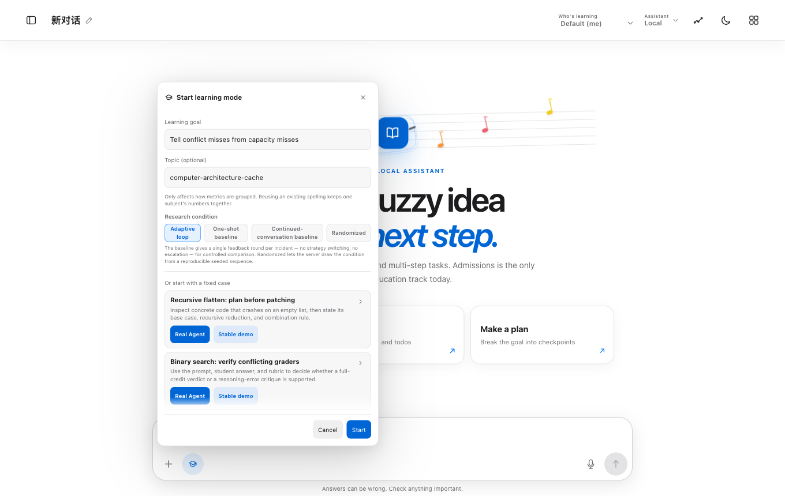
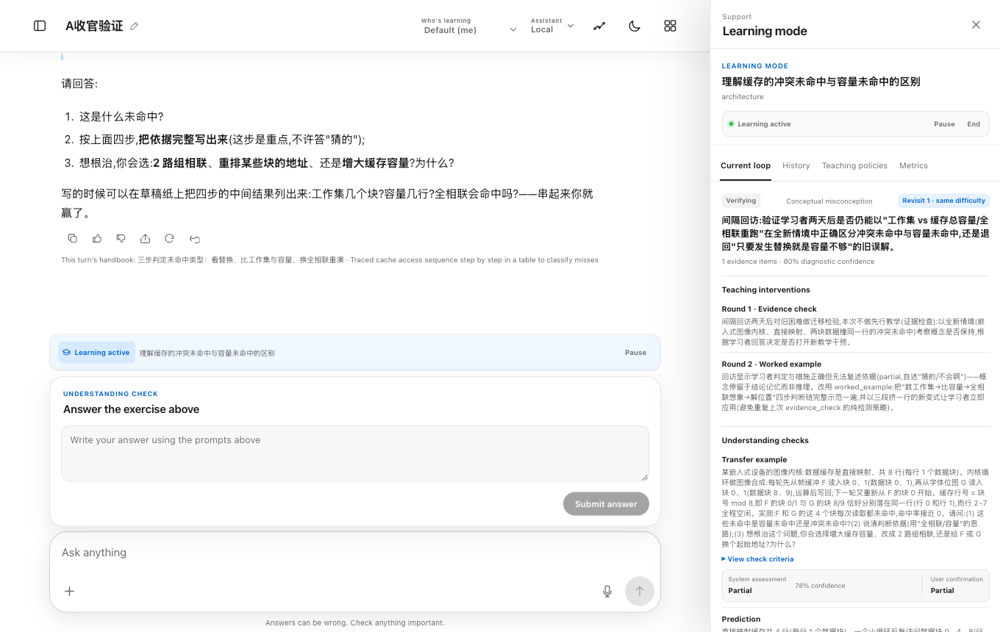
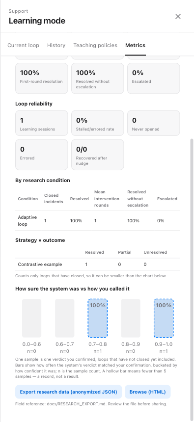
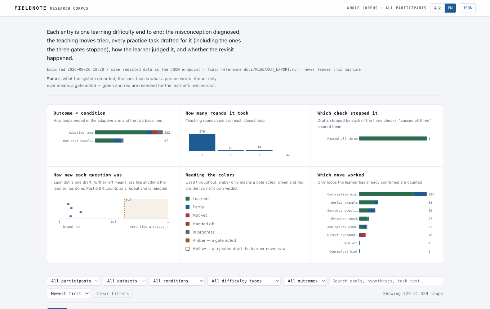

# 科研使用指南:教学值班回路

*[English version / 英文版](RESEARCH_GUIDE.md)*

本指南写给第一次接触 Fieldnote 的合作者——教师、助教或研究者,只讲科研这条线:自适应学习回路、现场生成的检查题,以及它们产出的数据。所有东西都在一台本地机器上运行,学生数据不出机器。(截图为英文界面,产品内置中英文切换。)

## 1. 研究的是什么

学生常常改掉了看得见的错误,却留着造成错误的那条误解。Fieldnote 在聊天助手之上包了一层**教学值班回路**:先带证据诊断出这个学习者的具体误解,再用明确的策略去教,教完用一道**现场新生成**的练习题验证,过几天还会回访同一个难点。

由此有两个研究问题:

1. 这个回路是否比一次性反馈用更少轮次、更持久地解决学习困难?
2. 它生成的检查题可信吗——自动评审员和人类专家的判断一致率有多高?

## 2. 一条回路从头到尾

1. **诊断。**导师说出它认为学习者持有的误解,引用学习者自己的原话作证据,并给出置信度。
2. **教学动作。**八种策略之一(对比例子、示范讲解、苏格拉底提问……)。失败过的策略不会重复。三轮仍未解决就停下,生成一份给真人教师的结构化交接报告。
3. **新题检查。**验证之前,导师必须针对这条误解现场起草一道新题。宿主先用三道质检门审核草稿(见第 5 节),学习者才会看到它。
4. **两份判定。**学习者作答后,系统提出判定(解决/部分/未解决)和置信度——然后由学习者亲自确认。**学习者的确认是最终结论;两份判定都会保存。**
5. **回访。**已解决的难点在 +2 天和 +5 天各用一道全新迁移题再考一次。回访是一条独立记录,用「第 N 次回访 · 同一个问题」标签链回原始记录——抓住"假解决"的知识衰减正是核心测量目标之一。

学习者看到的始终只是一段普通的辅导对话。诊断、置信度、策略、判定等框架数据全部住在侧边面板里,学生可见的正文绝不提及。

## 3. 三次点击亲手试

打开 Fieldnote → **New chat** → 点消息框旁边的 **Learning mode** 按钮。



- **Learning goal / Topic** 描述要学什么;Topic 只影响指标怎么分组。
- **Research condition** 选实验分组(见第 4 节)。
- 底部两个**固定案例**各有两个入口:
  - **Stable demo**(稳定演示)——确定性回放,不产生模型调用,每次都是同一条完整回路;
  - **Real Agent**(真实 Agent)——真实导师 Agent 现场跑回路,结果会变化,产生模型调用。

演示数据存在独立的 `demo` 命名空间,绝不混入真实研究数据。

## 4. 研究条件

| 条件 | 宿主强制执行的内容 |
| --- | --- |
| **Adaptive loop**(自适应回路) | 完整值班回路:诊断、换策略、生成检查题、升级交接、间隔回访。 |
| **One-shot baseline**(一次性反馈基线) | 每个难点只允许一轮反馈,宿主直接拒绝第二次干预。 |
| **Continued-conversation baseline**(持续对话基线) | 普通辅导聊天:不规划策略、不升级。 |
| **Randomized**(随机分配) | 服务端按可复现的种子序列抽取条件。 |

分组由宿主强制,不靠提示词自觉——基线条件在物理上就没有挂载出题工具。

## 5. 生成检查题与三道质检门

用题库旧题验证,测到的是记忆而不是理解。所以在自适应组,导师必须**在验证时现场出一道新题**,以诊断出的误解为条件,并在同一回合过三道门:

1. **程序硬门(免费):**题面为空、难度越界、预期答案泄漏进题面——直接拒。
2. **查重门(硬):**和这个学习者本会话见过的所有内容算相似度,太像(> 0.6)就拒——"换汤不换药"过不去。
3. **LLM 评审员(建议但从严):**四项检查——题目本身对不对、是否真能区分诊断出的那条误解、难度合不合适、够不够新。评审拒绝有效;基础设施出错则放行,回路永不因此卡死。

两次实质被拒后解锁普通文字出题的回退。**所有草稿包括被拒的全部入库**——质检器自己的行为也是可审计的数据。

## 6. 间隔回访



上图是一条真实回访:原难点曾确认解决,+2 天回访出了一道新迁移题,系统判**部分解决、置信度 78%**,学习者也确认了**部分解决**。回访是独立记录——原来那次解决在当时是真的——由蓝色的 **Revisit 1 · same difficulty** 标签链回原始回路。

## 7. 数据在哪里看

**面板的 Metrics 页签。**按主题的统计块、按条件的分组表、策略×结局表(只数已收尾的回路),以及图表 *"How sure the system was vs how you called it"*——每个样本是一次学习者确认过的判定,按系统当时的置信度分桶。这就是回路层面的"系统 vs 人"对照。



**研究语料页** `/api/learning/export/html`——每条回路从头到尾(诊断、教学动作、每一份草稿包括被门拦下的、判定、回访),可按参与者/数据集/条件/困难类型/结局筛选。中英双语,与 JSON 端点同一份脱敏数据。



**机器可读导出。**`GET /api/learning/export` 返回脱敏 JSON;每个字段的含义见 codebook:[RESEARCH_EXPORT.md](RESEARCH_EXPORT.md)。`?participantId=` 按学习者过滤。

**单回路报告。**学习者确认结果后,每条回路都有一页双语报告:`/api/learning/incidents/<id>/report.html`(加 `?download=true` 存成文件)——卡在哪、试了什么、为你出的题(含被门拦下你没见过的草稿),以及系统的提议和你自己的决定并排。

## 8. 校准协议——合作教师/助教的角色

生成题目的评审员(第 5 节第 3 道门)本身是需要验证的仪器:**它和人类专家的一致率有多高?**这是给合作者的一个具体、有边界的角色——标注 50–100 道题,不需要装任何软件。

1. 研究负责人导出标注表:

   ```bash
   node scripts/practice-item-calibration.mjs export --dataset live,eval --sample 100
   ```

   一行一道起草过的题(含被拒草稿)。机器列已填好,人工列空白;`datasetKind` / `condition` 两列说明每道题来自哪里。

2. 合作者逐行填写:四项检查各标 `pass` / `fail` / `unsure`(正确性、是否打在误解上、难度、新颖度),总体标 `approve` / `reject`,可加备注。任何表格软件都行。

3. 研究负责人生成报告:

   ```bash
   node scripts/practice-item-calibration.mjs report --labels filled.csv --labeler <name>
   ```

   产出:各项检查对"fail"的精确率/召回率、机会校正一致率(κ)、评审层空转(fail-open)次数,以及每一条分歧的类型清单。报告只描述**质检一致率**,不是学习效果证据;自标注版本会在报告头注明只是协议烟测。

## 9. 多个学习者

每个学习者是一个**参与者(participant)**,记录完全隔离:经验、策略统计、回访计划、指标和导出互不混淆;机主的个人记忆不会进入参与者的提示词,反之亦然。几名学生的小规模试点不需要任何额外搭建。

## 10. 目前的证据与边界

- 迄今唯一的量化结果来自**模拟学习者的离线评测**:回路的首次诊断在 **166/176 个会话(94%)**中与剧本设定的误解一致。没有任何真实学生,因此这不说明学习效果。
- 更早的模拟结果对比已经废弃——我们记录了为什么 LLM 模拟的学习者不可能令人信服地"学不会";事后分析在本仓库公开。
- 明确的非目标:LMS 集成、题库、评分产品、多租户托管。

## 视频演示

- [ ] 90 秒回路演示——*待补充*
- [ ] 校准协议操作演示——*待补充*
