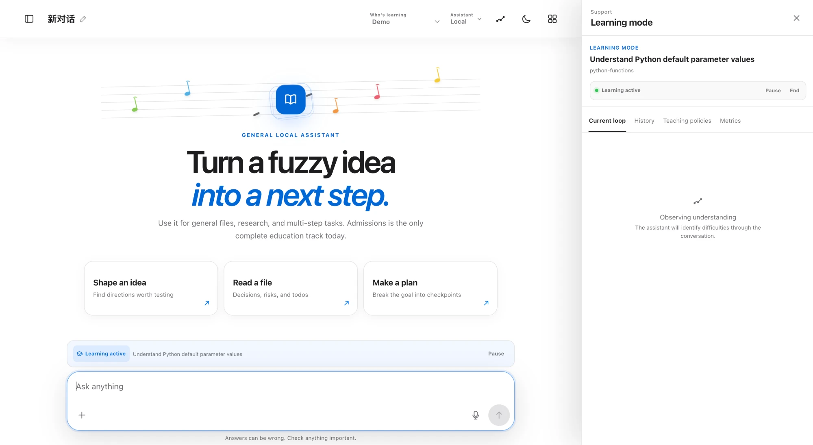
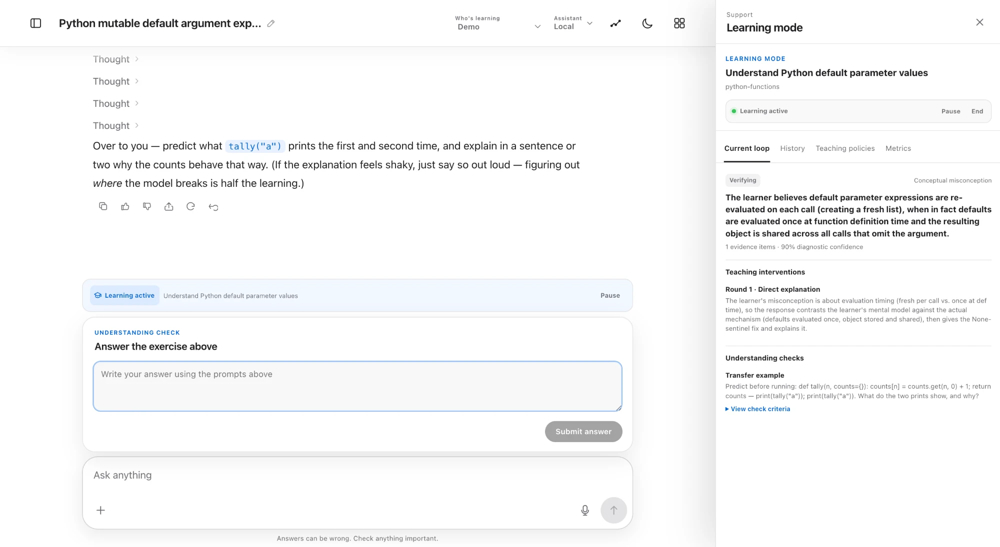
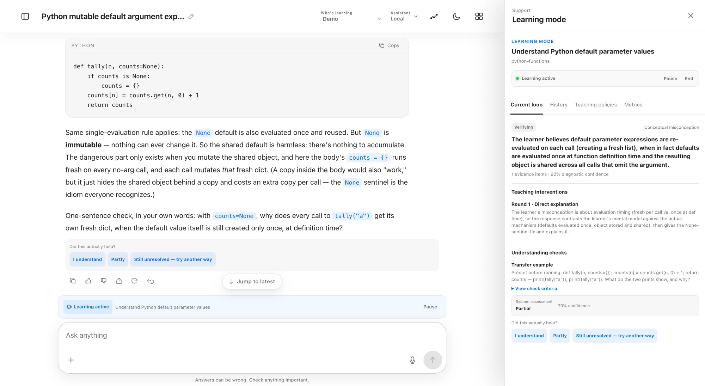
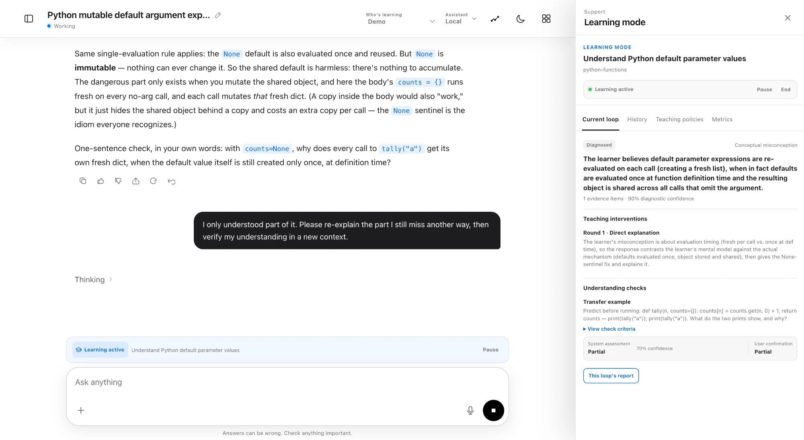
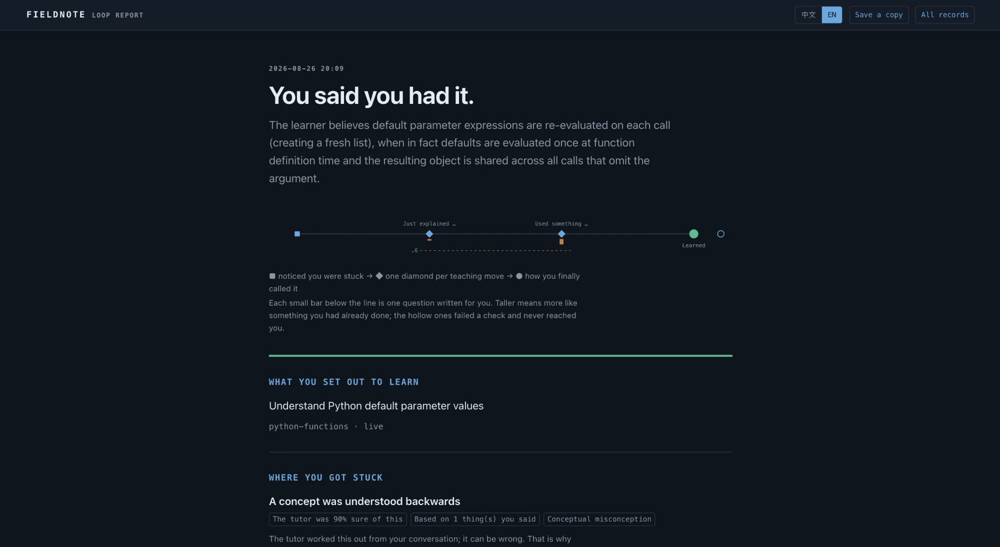
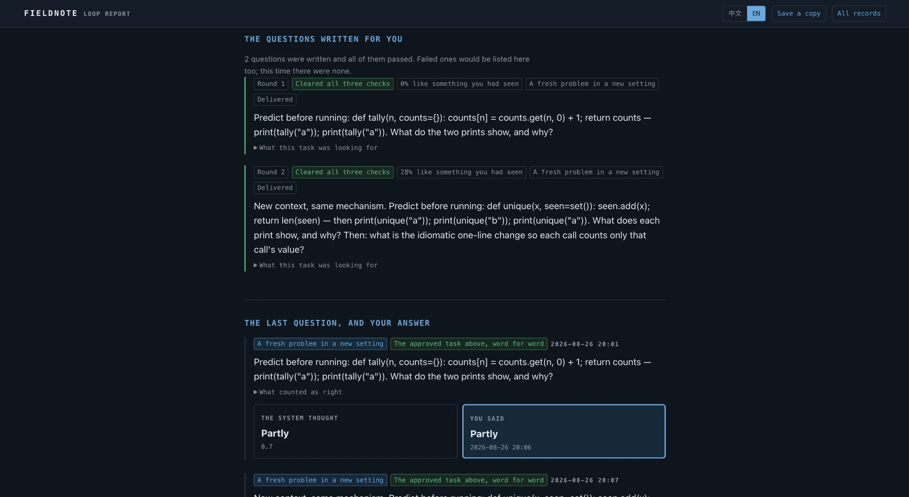
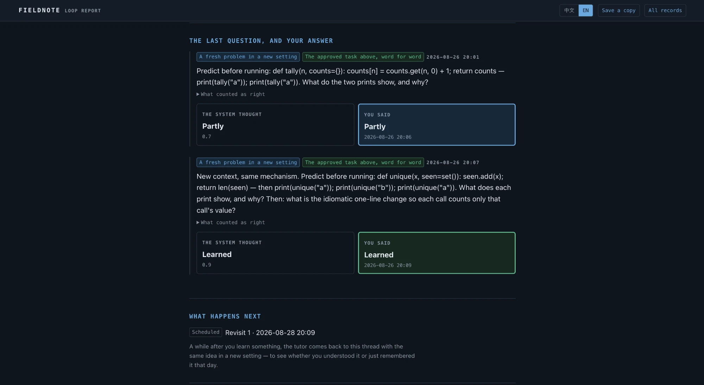
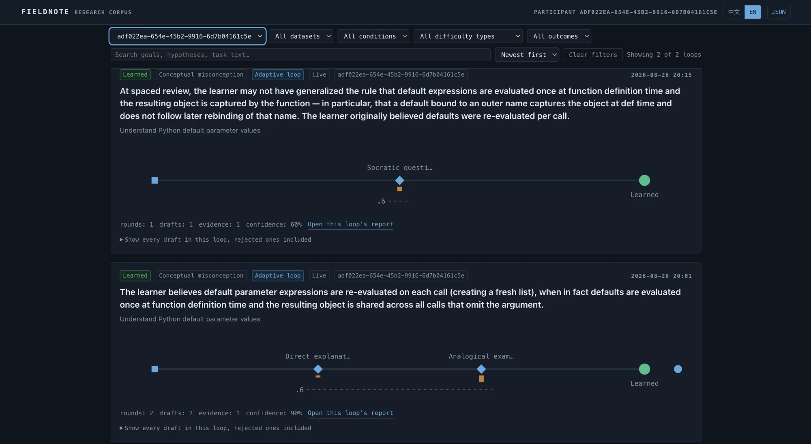

# Fieldnote 科研版:教学值班回路

*[English version / 英文版](RESEARCH_GUIDE.md)*

本文写给第一次接触 Fieldnote 的读者——计算机教育研究者、教师或助教。先讲清研究问题,然后用产品里**一条完整、未剪辑的真实会话**从头走到尾,用这条会话的截图逐一说明系统的每个部件如何对应到研究议程上。所有东西都在一台本地机器上运行,学生数据不出机器。系统已开源:[github.com/YukunHe16/fieldnote](https://github.com/YukunHe16/fieldnote)。(截图为英文界面;产品内置中英切换。)

## 1. 研究问题

学生常常改掉了看得见的错误,却留着造成错误的那条误解——能复述规则,下手还是老一套。由此有两个测量难题:

- **一次性反馈是很弱的学习信号。**讲解之后立刻答对,分不清是理解了还是短期记住了。
- **用题库旧题复查,会把记忆混进掌握**;而要写出真正能判别误解的练习,前提是知道*这个*学习者持有哪条误解——这种知识通常只有一份静态的通用清单。

Fieldnote 是围绕这两个难题造出来的工作仪器。它在聊天导师之上包了一层**教学值班回路**:从证据出发诊断个体学习者的误解、用明确的策略去教、用一道**现场新生成**、直指这条误解的题目验证、由学习者(而不是模型)给出最终结论、几天后再回访同一难点。每一步都留下研究级的记录。

这台仪器为三个问题而造:

1. 自适应回路是否比一次性反馈用更少轮次、更持久地解决学习困难?
2. **验证时现场生成、以实时诊断为条件**的检查题,是否比复用旧题更能测出真实理解——体现为假解决率的差异?
3. 系统的判断——结果判定与生成题目的质量评审——与人类判断的一致率有多高?

## 2. 一条完整会话,从头到尾

以下全部来自同一条真实会话(约十五分钟),记录在隔离的演示参与者名下。学习者由作者扮演,带着一条经典 Python 误解——*"`items=[]` 这样的可变默认值每次调用都会新建列表"*。没有任何真实学生参与。

### 2.1 会话一开始就声明研究条件

开启学习模式要填学习目标、可选主题(只影响指标分组),并选择**研究条件**:自适应回路、一次性反馈基线、持续对话基线,或由服务端按可复现种子序列随机分配。条件由宿主强制执行而非靠提示词自觉——基线在物理上就没有出题工具,一次性基线会直接拒绝第二次干预。

学习者看到的只是一段普通聊天。诊断、置信度、策略、判定等框架数据全部住在侧边面板里,学生可见的对话绝不提及。

### 2.2 带证据的诊断,和一道为这条误解现写的题

学习者问为什么 `add_item('b')` 返回了 `['a', 'b']`,并说出自己的理解:"`items=[]` 每次调用都会重新求值"。导师不是简单作答——它记录诊断,并在验证之前**现场起草一道全新练习题**,直指诊断出的误解(这里:同一条规则,把列表换成字典)。

右侧面板:诊断出的误解、**1 条证据 · 90% 诊断置信度**、第一轮策略(直接讲解)及其理由、送达的迁移题。这道题在学习者看到之前,先过了宿主的三道门:确定性的答案泄漏检查、对该学习者全部已见内容的查重(太像就拒)、以及 LLM 题目评审员对正确性、**是否打在诊断出的误解上**、难度、新颖度四项的判定。所有草稿——包括被拒的——全部入库可审计。

### 2.3 每道题两份判定;学习者说了算

学习者故意只答对一半:预测正确、机制说错("Python 按引用传递字典")。系统提出自己的判定和置信度——然后问学习者。

这个"两份判定"设计贯穿全系统:机器判断与人的判断都保存、从不合并,人的判断是最终结论。这正是"模型判断必须对照人类判断校验"这一方法论要求在回路层面的体现。

### 2.4 部分理解自动欠一轮——而且必须换策略

学习者点了 **Partly**。系统没有就此停下:它自动替学习者开启下一轮,失败过的策略禁止重复。

第二轮换成类比讲解(默认值是存在函数"口袋"里的对象),配一道新的过闸迁移题——集合替换了字典。这次学习者答对并确认 **I understand**。回路有界:三轮失败后系统停止,生成给真人教师的结构化交接报告,而不是无限磨下去。

### 2.5 每条收尾的回路都渲染成可审计的报告

一条回路一页报告,来自同一批记录:导师当时的判断和把握、每一种尝试过的策略和*它期望听到什么*、为这位学习者写的每一道题——

——连同过门结果和新颖度分数(这里与已见内容的相似度分别为 0% 和 28%),最后是每道题的**系统判定与学习者判定并排**,以及已排期的回访:

### 2.6 回访:延迟迁移,记成独立回路

两天后——本次录制通过本地开关把等待压缩到了几分钟;研究口径是 +2 天和 +5 天——导师自己回到同一线程,带来一道学习者没见过的情境:默认值绑定到外层名字、名字随后被重绑。

回访是刻意的**独立记录**,靠「Revisit 1 · same difficulty」标签链回原始难点——当初的解决在当时是真的,而衰减掉的"假解决"会表现为一次失败的回访。延迟迁移和假解决率在这里是一等公民,不是事后补充。

### 2.7 数据立刻长什么样

面板的指标页按主题和研究条件聚合,并绘制*系统当时有多确定 vs 学习者怎么判*——每个样本是一次学习者确认过的判定(这里:0.7 的 Partly,0.9 和 0.95 的两次 Learned)。

语料页渲染的是**与 JSON 导出完全相同的脱敏数据**(`GET /api/learning/export`;每个字段见 [RESEARCH_EXPORT.md](RESEARCH_EXPORT.md))。参与者只以假名 ID 出现——显示名永远不进导出层。注意筛选器:参与者、数据集(live / demo / replay 是硬隔离的命名空间)、条件、困难类型、结局。

## 3. 与研究议程的对应

**面向误解的练习生成。**生成错误示例与判别性练习的公认瓶颈,是对学生误解的深入了解——通常只有一份静态通用清单。这条回路补上了缺失的输入:**实时的、有证据的、按学习者的诊断**,并把生成放进补救过程*内部*、发生在验证时刻。题目评审员的*是否打在误解上*检查,正是"针对性练习"区别于"话题相关练习"的那个属性。设计内置的对照:复用旧题验证 vs 现场生成验证——假解决率之差就是回路内生成的可测贡献。

**模型判断对照人类判断,在两个层面。**结果层面,每次判定都是一对——系统提议带置信度、学习者确认——置信度对照图就是持续累积的一致性记录。仪器层面,LLM 题目评审员本身要过**校准协议**:导出题目标注表(`node scripts/practice-item-calibration.mjs export --dataset live,eval --sample 100`),由人类专家按同样四项检查逐题标注并给出总体 approve/reject(任何表格软件即可;50–100 题,是给教师或助教的一个有边界、定义清晰的角色),report 命令输出各项检查对"fail"的精确率/召回率、机会校正一致率(κ)、评审员空转次数和分歧类型清单。报告明确只是质检一致率,不是学习效果证据。

**在强制条件下做结果导向的评估。**到掌握所需轮次、即时与延迟迁移、假解决率都是一等记录;分组由宿主强制而非提示词纪律。按学习者隔离(参与者轴)让多学生试点天然干净:策略统计、回访计划、指标与导出互不混淆,机主的个人数据也不会进入参与者的提示词。

## 4. 目前的证据与边界

- 迄今唯一的量化结果来自**模拟学习者的离线评测**:回路的首次诊断在 **166/176 个会话(94%)**中与剧本设定的误解一致。模拟学习者不能说明学习效果。
- 更早的模拟结果对比已**废弃**——我们记录了为什么 LLM 模拟的学习者不可能令人信服地"学不会";事后分析在本仓库公开。
- 上面的完整会话是作者的角色扮演演示,记录在隔离的演示命名空间,回访间隔为演示而压缩。没有收集任何学生数据。
- 明确的非目标:LMS 集成、题库、评分产品、多租户托管。

## 5. 亲手试

打开 Fieldnote → **New chat** → **Learning mode**。设置弹窗底部两个固定案例各有 **Stable demo**(确定性回放,零模型调用)和 **Real Agent**(真实导师 Agent,结果会变化)两个入口。演示数据在独立命名空间,绝不混入真实研究数据。
